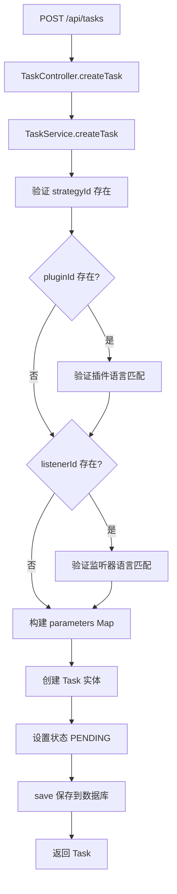
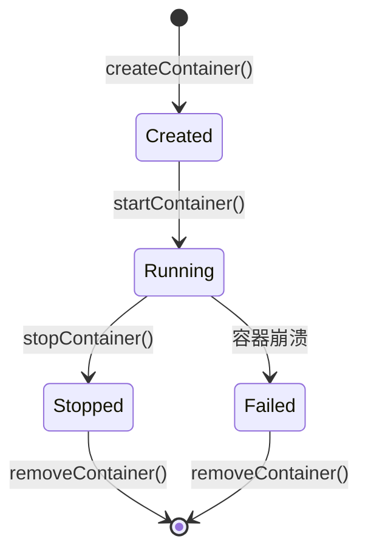

# Issue #5: 任务创建和持久化实现文档

## 概述

Issue #5 实现了任务的创建、验证和持久化功能。支持配置策略、数据插件和监听器，并进行语言匹配验证。

## 主要实现类

### 1. CreateTaskDTO
**路径**: `hs-taskm-common/src/main/java/com/taskm/dto/CreateTaskDTO.java`

```java
@Data
public class CreateTaskDTO {
    private Long strategyId;           // 必填
    private Long pluginId;             // 可选
    private Long listenerId;           // 可选
    private Map<String, Object> strategyParams;
    private Map<String, Object> pluginParams;
    private Map<String, Object> listenerParams;
}
```

### 2. TaskServiceImpl
**路径**: `hs-taskm-service/src/main/java/com/taskm/service/impl/TaskServiceImpl.java`

**核心方法**:
```java
@Override
@Transactional
public Task createTask(CreateTaskDTO taskDTO) {
    // 1. 验证策略存在
    Strategy strategy = strategyService.getStrategy(taskDTO.getStrategyId());

    // 2. 验证插件语言匹配
    if (taskDTO.getPluginId() != null) {
        DataPlugin plugin = dataPluginService.getPlugin(taskDTO.getPluginId());
        if (!strategy.getLanguage().equals(plugin.getLanguage())) {
            throw new IllegalArgumentException("Language mismatch");
        }
    }

    // 3. 验证监听器语言匹配
    if (taskDTO.getListenerId() != null) {
        Listener listener = listenerService.getListener(taskDTO.getListenerId());
        if (!strategy.getLanguage().equals(listener.getLanguage())) {
            throw new IllegalArgumentException("Language mismatch");
        }
    }

    // 4. 构建任务参数
    Map<String, Object> parameters = new HashMap<>();
    parameters.put("strategyId", taskDTO.getStrategyId());
    parameters.put("strategyParams", taskDTO.getStrategyParams() != null ?
        taskDTO.getStrategyParams() : new HashMap<>());

    if (plugin != null) {
        parameters.put("pluginId", taskDTO.getPluginId());
        parameters.put("pluginParams", taskDTO.getPluginParams() != null ?
            taskDTO.getPluginParams() : new HashMap<>());
    }

    if (listener != null) {
        parameters.put("listenerId", taskDTO.getListenerId());
        parameters.put("listenerParams", taskDTO.getListenerParams() != null ?
            taskDTO.getListenerParams() : new HashMap<>());
    }

    // 5. 创建任务实体
    Task task = new Task();
    task.setStrategyId(taskDTO.getStrategyId());
    task.setStatus("PENDING");
    task.setParameters(parameters);

    // 6. 保存到数据库
    save(task);

    return task;
}
```

### 3. TaskController
**路径**: `hs-taskm-api/src/main/java/com/taskm/controller/TaskController.java`

```java
@PostMapping
@ResponseStatus(HttpStatus.CREATED)
public Result<Task> createTask(@RequestBody CreateTaskDTO taskDTO) {
    Task task = taskService.createTask(taskDTO);
    return Result.success("Task created successfully", task);
}
```

## 核心流程



## REST API 端点

```
POST /api/tasks
Content-Type: application/json

{
  "strategyId": 1,
  "pluginId": 2,
  "listenerId": 3,
  "strategyParams": {
    "param1": "value1"
  },
  "pluginParams": {
    "param2": "value2"
  }
}
```

**响应**:
```json
{
  "code": 200,
  "message": "Task created successfully",
  "data": {
    "id": 1,
    "strategyId": 1,
    "status": "PENDING",
    "parameters": {...},
    "createdAt": "2024-01-01T10:00:00"
  }
}
```

## 测试用例

| 测试用例 | 描述 |
|---------|------|
| canCreateTaskWithOnlyStrategy | 只配置策略创建任务 |
| canCreateTaskWithPlugin | 配置策略和插件 |
| canCreateTaskWithListener | 配置策略和监听器 |
| canCreateTaskWithAllComponents | 配置全部组件 |
| shouldThrowExceptionWhenLanguageMismatchPlugin | 插件语言不匹配抛异常 |
| shouldThrowExceptionWhenLanguageMismatchListener | 监听器语言不匹配抛异常 |

## 相关 Issue

- **依赖**: Issue #2 (策略查询 API) - 验证策略存在
- **依赖**: Issue #3 (插件查询 API) - 验证插件存在和语言
- **依赖**: Issue #4 (监听器查询 API) - 验证监听器存在和语言

---

# Issue #6: Container Lifecycle Manager 实现文档

## 概述

Issue #6 实现了 Docker 容器的生命周期管理，包括创建、启动、停止、删除容器，以及查询容器状态和指标。

## 主要实现类

### 1. ContainerLifecycleManager 接口
**路径**: `hs-taskm-core/src/main/java/com/taskm/service/ContainerLifecycleManager.java`

```java
public interface ContainerLifecycleManager {
    String createContainer(String imageId, Long taskId, ContainerConfig config);
    void startContainer(String containerId);
    void stopContainer(String containerId, int timeoutSeconds);
    void removeContainer(String containerId);
    ContainerStatus getContainerStatus(String containerId);
    ContainerMetrics getContainerMetrics(String containerId);
}
```

### 2. ContainerLifecycleManagerImpl
**路径**: `hs-taskm-core/src/main/java/com/taskm/service/impl/ContainerLifecycleManagerImpl.java`

```java
@Service
public class ContainerLifecycleManagerImpl implements ContainerLifecycleManager {

    private final DockerClient dockerClient;

    @Autowired
    public ContainerLifecycleManagerImpl(DockerClient dockerClient) {
        this.dockerClient = dockerClient;
    }

    @Override
    public String createContainer(String imageId, Long taskId, ContainerConfig config) {
        CreateContainerResponse response = dockerClient.createContainerCmd(imageId)
            .withName(config.getName())
            .withEnv(config.getEnv())
            .withHostConfig(
                HostConfig.newHostConfig()
                    .withBinds(config.getVolumeBinds())
                    .withPortBindings(config.getPortBindings())
            )
            .withWorkingDir(config.getWorkingDir())
            .withCmd(config.getCommand())
            .exec();

        return response.getId();
    }

    @Override
    public void startContainer(String containerId) {
        dockerClient.startContainerCmd(containerId).exec();
    }

    @Override
    public void stopContainer(String containerId, int timeoutSeconds) {
        dockerClient.stopContainerCmd(containerId)
            .withTimeout(timeoutSeconds)
            .exec();
    }

    @Override
    public void removeContainer(String containerId) {
        dockerClient.removeContainerCmd(containerId).exec();
    }

    @Override
    public ContainerStatus getContainerStatus(String containerId) {
        InspectContainerResponse response = dockerClient.inspectContainerCmd(containerId).exec();
        String status = response.getState().getStatus();

        return switch (status.toLowerCase()) {
            case "created" -> ContainerStatus.CREATED;
            case "running" -> ContainerStatus.RUNNING;
            case "exited" -> ContainerStatus.STOPPED;
            case "dead" -> ContainerStatus.FAILED;
            default -> ContainerStatus.UNKNOWN;
        };
    }
}
```

### 3. ContainerConfig DTO
**路径**: `hs-taskm-common/src/main/java/com/taskm/dto/ContainerConfig.java`

```java
@Data
public class ContainerConfig {
    private String name;                    // 容器名称
    private List<String> env;               // 环境变量
    private List<String> volumeBinds;       // 卷挂载
    private Map<String, List<PortBinding>> portBindings;  // 端口绑定
    private String workingDir;              // 工作目录
    private String[] command;               // 启动命令
}
```

### 4. ContainerStatus 枚举
**路径**: `hs-taskm-common/src/main/java/com/taskm/dto/ContainerStatus.java`

```java
public enum ContainerStatus {
    CREATED,
    RUNNING,
    STOPPED,
    FAILED,
    UNKNOWN
}
```

## 核心流程

### 容器生命周期



## Docker 集成

### DockerClient 配置
**路径**: `hs-taskm-core/src/main/java/com/taskm/config/DockerConfig.java`

```java
@Configuration
public class DockerConfig {

    @Bean
    public DockerClient dockerClient() {
        return DockerClientBuilder.getInstance()
            .withDockerHost("unix:///var/run/docker.sock")
            .build();
    }
}
```

## 测试用例

| 测试用例 | 描述 |
|---------|------|
| testCreateContainer | 创建容器返回容器 ID |
| testStartContainer | 启动容器成功 |
| testStopContainer | 停止容器成功 |
| testGetContainerStatus | 查询容器状态 |
| testRemoveContainer | 删除容器成功 |

## 相关 Issue

- **使用方**: Issue #8 (Code Snippet Injector) - 准备容器配置
- **使用方**: Issue #9 (任务启动流程) - 创建和启动容器
- **使用方**: Issue #10 (任务停止流程) - 停止和删除容器
- **使用方**: Issue #11 (Resource Monitor) - 查询容器指标
