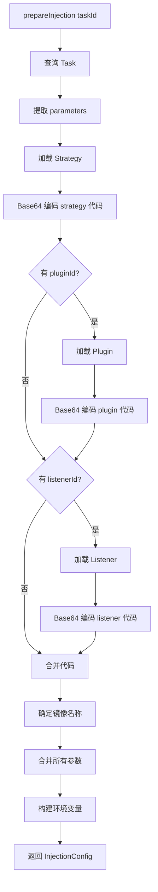
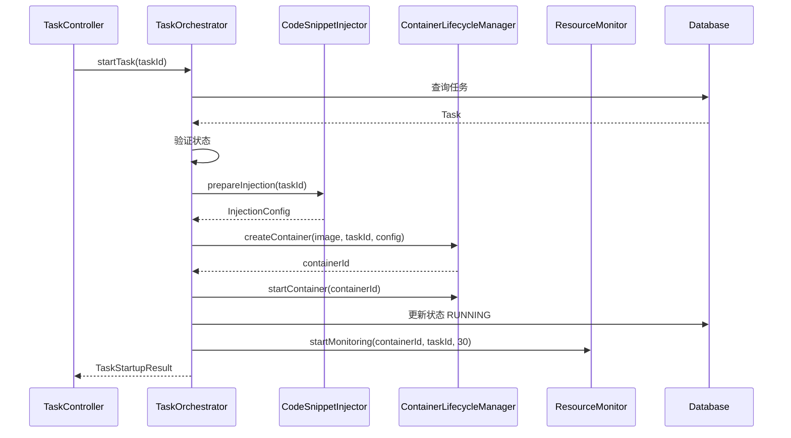
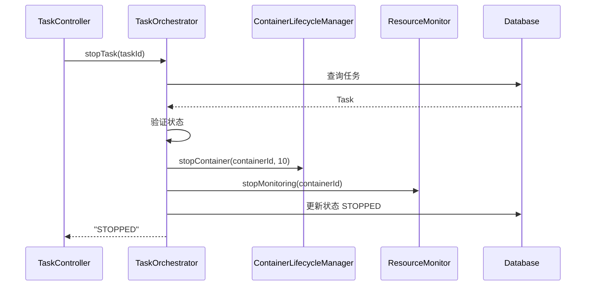

# Issue #7: Code Snippet Injector 实现文档

## 概述

Issue #7 实现代码片段注入功能，将策略、插件和监听器的代码注入到 Docker 容器中，并进行参数合并和 Base64 编码。

## 主要实现类

### 1. InjectionConfig DTO
**路径**: `hs-taskm-common/src/main/java/com/taskm/dto/InjectionConfig.java`

```java
@Data
public class InjectionConfig {
    private String imageName;              // Docker 镜像名
    private List<String> envVars;           // 环境变量列表
    private List<VolumeMount> volumeMounts; // 卷挂载列表
    private String codeSnippet;             // Base64 编码的代码
    private Map<String, Object> parameters; // 合并后的参数
}
```

### 2. CodeSnippetInjector 接口
**路径**: `hs-taskm-core/src/main/java/com/taskm/service/CodeSnippetInjector.java`

```java
public interface CodeSnippetInjector {
    InjectionConfig prepareInjection(Long taskId);

    String loadAndEncodeCode(Long id, String type);

    Map<String, Object> mergeParameters(Map<String, Object> configParams,
                                       Map<String, Object> userParams);
}
```

### 3. CodeSnippetInjectorImpl
**路径**: `hs-taskm-core/src/main/java/com/taskm/service/impl/CodeSnippetInjectorImpl.java`

**核心方法实现**:

#### 准备注入配置
```java
@Override
public InjectionConfig prepareInjection(Long taskId) {
    // 1. 查询任务
    Task task = taskMapper.selectById(taskId);
    Map<String, Object> params = task.getParameters();

    // 2. 加载策略
    Long strategyId = (Long) params.get("strategyId");
    Strategy strategy = strategyMapper.selectById(strategyId);
    String strategyCode = loadAndEncodeCode(strategyId, "strategy");

    // 3. 加载插件（可选）
    String pluginCode = null;
    if (params.containsKey("pluginId")) {
        Long pluginId = (Long) params.get("pluginId");
        DataPlugin plugin = dataPluginMapper.selectById(pluginId);
        pluginCode = loadAndEncodeCode(pluginId, "plugin");
    }

    // 4. 加载监听器（可选）
    String listenerCode = null;
    if (params.containsKey("listenerId")) {
        Long listenerId = (Long) params.get("listenerId");
        Listener listener = listenerMapper.selectById(listenerId);
        listenerCode = loadAndEncodeCode(listenerId, "listener");
    }

    // 5. 合并代码
    String fullCode = strategyCode + "\n" +
        (pluginCode != null ? pluginCode + "\n" : "") +
        (listenerCode != null ? listenerCode : "");

    // 6. 构建 InjectionConfig
    InjectionConfig config = new InjectionConfig();
    config.setImageName(determineImageName(strategy.getLanguage()));
    config.setCodeSnippet(fullCode);
    config.setParameters(mergeAllParameters(params));
    config.setEnvVars(buildEnvironmentVariables(config));

    return config;
}
```

#### Base64 编码代码
```java
@Override
public String loadAndEncodeCode(Long id, String type) {
    String code = switch (type) {
        case "strategy" -> strategyMapper.selectById(id).getCode();
        case "plugin" -> dataPluginMapper.selectById(id).getCode();
        case "listener" -> listenerMapper.selectById(id).getCode();
        default -> throw new IllegalArgumentException("Unknown type: " + type);
    };

    return Base64.getEncoder().encodeToString(code.getBytes());
}
```

#### 参数合并
```java
private Map<String, Object> mergePluginParameters(DataPlugin plugin,
                                                   Map<String, Object> userParams) {
    Map<String, Object> merged = new HashMap<>();

    // 1. 加载默认参数
    if (plugin.getConfigParameters() != null) {
        Map<String, Object> configParams = plugin.getConfigParameters();
        Object paramsObj = configParams.get("parameters");
        if (paramsObj instanceof List) {
            List<Map<String, Object>> paramDefs = (List<Map<String, Object>>) paramsObj;
            for (Map<String, Object> paramDef : paramDefs) {
                String name = (String) paramDef.get("name");
                Object defaultValue = paramDef.get("default");
                if (defaultValue != null) {
                    merged.put(name, defaultValue);
                }
            }
        }
    }

    // 2. 用户参数覆盖默认值
    if (userParams != null) {
        merged.putAll(userParams);
    }

    return merged;
}
```

## 核心流程



## Docker 镜像映射

```java
private String determineImageName(String language) {
    return switch (language.toLowerCase()) {
        case "java" -> "openjdk:17-slim";
        case "python" -> "python:3.9-slim";
        case "go" -> "golang:1.21-alpine";
        case "javascript" -> "node:18-alpine";
        default -> throw new IllegalArgumentException("Unsupported language: " + language);
    };
}
```

## 测试用例

### CodeSnippetInjectorTest (18个测试)

| 测试用例 | 描述 |
|---------|------|
| testPrepareInjection_shouldLoadStrategyAndPlugin | 加载策略和插件 |
| testPrepareInjection_shouldLoadAllComponents | 加载全部组件 |
| testPrepareInjection_shouldMergeParameters | 参数合并 |
| testLoadAndEncodeCode_shouldBase64EncodeStrategy | Base64 编码策略 |
| testMergePluginParameters_shouldUseDefaults | 使用默认参数 |
| testMergePluginParameters_userParamsOverrideDefaults | 用户参数覆盖默认 |
| testPrepareInjection_shouldThrowExceptionWhenStrategyNotFound | 策略不存在抛异常 |
| testPrepareInjection_shouldThrowExceptionWhenLanguageMismatchPlugin | 语言不匹配抛异常 |

## 相关 Issue

- **依赖**: Issue #2-#4 (查询 API) - 加载策略/插件/监听器
- **依赖**: Issue #5 (任务创建) - 使用任务的 parameters
- **依赖**: Issue #6 (Container Lifecycle Manager) - 使用容器配置
- **使用方**: Issue #9 (任务启动流程) - 准备容器注入配置

---

# Issue #8-#9: 任务启动和停止流程实现文档

## 概述

Issue #8 和 #9 实现了任务的完整启动流程和停止流程，包括编排各个服务、更新任务状态、启停监控等。

## Issue #8: 任务启动流程

### TaskOrchestrator 接口
**路径**: `hs-taskm-core/src/main/java/com/taskm/service/TaskOrchestrator.java`

```java
public interface TaskOrchestrator {
    TaskStartupResult startTask(Long taskId);
    String stopTask(Long taskId);
    boolean canStartTask(Long taskId);
    boolean canStopTask(Long taskId);
}
```

### TaskOrchestratorImpl 核心实现

#### 启动任务流程
```java
@Override
@Transactional
public TaskStartupResult startTask(Long taskId) {
    // 1. 查询任务
    Task task = taskMapper.selectById(taskId);

    // 2. 验证状态
    if (!canStartTask(taskId)) {
        return TaskStartupResult.failure(taskId,
            "Task cannot be started in current state: " + task.getStatus());
    }

    // 3. 准备注入配置
    InjectionConfig injectionConfig = codeSnippetInjector.prepareInjection(taskId);

    // 4. 创建容器
    String containerId = containerLifecycleManager.createContainer(
        injectionConfig.getImageName(),
        taskId,
        buildContainerConfig(injectionConfig)
    );

    // 5. 启动容器
    containerLifecycleManager.startContainer(containerId);

    // 6. 更新任务状态
    task.setStatus("RUNNING");
    task.setStartedAt(LocalDateTime.now());
    task.setContainerId(containerId);
    taskMapper.updateById(task);

    // 7. 启动监控
    resourceMonitor.startMonitoring(containerId, taskId, 30);

    return TaskStartupResult.success(taskId, containerId);
}
```

### 启动流程图



## Issue #9: 任务停止流程

### 停止任务流程
```java
@Override
@Transactional
public String stopTask(Long taskId) {
    // 1. 查询任务
    Task task = taskMapper.selectById(taskId);

    // 2. 验证状态
    if (!canStopTask(taskId)) {
        throw new InvalidTaskStatusException(
            "Task cannot be stopped in current state: " + task.getStatus());
    }

    String containerId = task.getContainerId();

    // 3. 停止容器
    if (containerId != null && !containerId.isEmpty()) {
        containerLifecycleManager.stopContainer(containerId, 10);
    }

    // 4. 停止监控
    if (containerId != null) {
        resourceMonitor.stopMonitoring(containerId);
    }

    // 5. 更新任务状态
    task.setStatus("STOPPED");
    task.setCompletedAt(LocalDateTime.now());
    taskMapper.updateById(task);

    return "STOPPED";
}
```

### 停止流程图



## REST API 端点

### 启动任务
```
POST /api/tasks/{id}/start

响应:
{
  "code": 200,
  "message": "Task started successfully",
  "data": {
    "taskId": 1,
    "containerId": "abc123",
    "status": "RUNNING",
    "success": true
  }
}
```

### 停止任务
```
POST /api/tasks/{id}/stop

响应:
{
  "code": 200,
  "message": "Task stopped successfully",
  "data": "STOPPED"
}
```

## 测试用例

### TaskOrchestratorTest (16个测试)

| 测试用例 | 描述 |
|---------|------|
| testStartTask_shouldSucceed | 成功启动任务 |
| testStartTask_shouldFailWhenInvalidStatus | 状态无效时失败 |
| testStopTask_shouldSucceed | 成功停止任务 |
| testStopTask_shouldUpdateTaskStatus | 更新任务状态 |
| testStopTask_shouldStopMonitoring | 停止监控 |
| testCanStartTask_allowsOnlyPendingOrCreated | 只允许 PENDING/CREATED 状态启动 |
| testCanStopTask_allowsOnlyRunning | 只允许 RUNNING 状态停止 |

## 相关 Issue

- **依赖**: Issue #5 (任务创建) - 创建待启动的任务
- **依赖**: Issue #6 (Container Lifecycle Manager) - 容器操作
- **依赖**: Issue #7 (Code Snippet Injector) - 准备注入配置
- **依赖**: Issue #11 (Resource Monitor) - 监控容器
- **使用方**: Issue #12 (Log Router) - 日志记录
