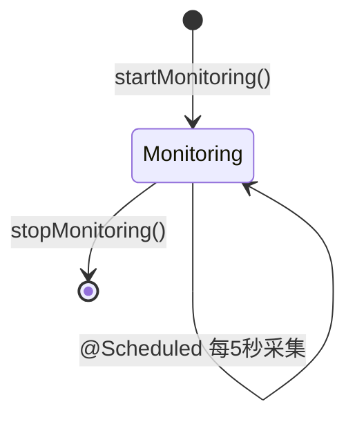
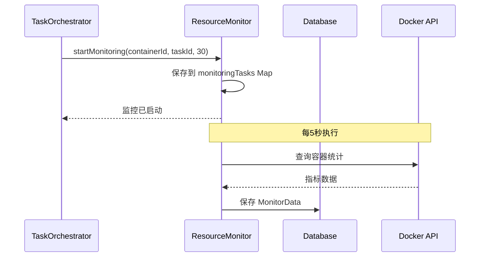

# Issue #10: Resource Monitor 实现文档

**注意**: 此 Issue 在 GitHub 上标记为 #11，但在内部实现中对应 Resource Monitor 功能。

## 概述

Resource Monitor 负责监控 Docker 容器的资源使用情况，包括 CPU、内存、网络和磁盘 I/O。支持定时采集、历史查询和实时监控。

## 主要实现类

### 1. ResourceMonitor 接口
**路径**: `hs-taskm-core/src/main/java/com/taskm/service/ResourceMonitor.java`

```java
public interface ResourceMonitor {
    // 监控管理
    void startMonitoring(String containerId, Long taskId, int intervalSeconds);
    void stopMonitoring(String containerId);
    boolean isMonitoring(String containerId);

    // 指标采集
    MonitorData collectMetrics(String containerId, Long taskId);

    // 查询接口
    ContainerMetrics getCurrentMetrics(Long taskId);
    List<MonitorData> getMetricsHistory(Long taskId, LocalDateTime startTime, LocalDateTime endTime);
}
```

### 2. ResourceMonitorImpl
**路径**: `hs-taskm-core/src/main/java/com/taskm/service/impl/ResourceMonitorImpl.java`

**核心字段**:
```java
@Service
public class ResourceMonitorImpl implements ResourceMonitor {

    private final MonitorDataMapper monitorDataMapper;
    private final ContainerLifecycleManager containerLifecycleManager;

    // 监控任务集合：containerId -> MonitoringTask
    private final Map<String, MonitoringTask> monitoringTasks = new ConcurrentHashMap<>();

    @Value("${monitoring.default.interval:30}")
    private int defaultIntervalSeconds;

    @Value("${monitoring.retention.days:7}")
    private int retentionDays;
}
```

**核心方法实现**:

#### 启动监控
```java
@Override
public void startMonitoring(String containerId, Long taskId, int intervalSeconds) {
    logger.info("Starting monitoring for container {} (task {}) with interval {}s",
        containerId, taskId, intervalSeconds);

    monitoringTasks.put(containerId, new MonitoringTask(taskId, intervalSeconds));
}
```

#### 停止监控
```java
@Override
public void stopMonitoring(String containerId) {
    logger.info("Stopping monitoring for container {}", containerId);
    monitoringTasks.remove(containerId);
}
```

#### 定时采集
```java
@Scheduled(fixedRateString = "${monitoring.schedule.rate:5000}")
public void scheduledMetricCollection() {
    if (monitoringTasks.isEmpty()) {
        return;
    }

    logger.debug("Collecting metrics for {} containers", monitoringTasks.size());

    monitoringTasks.forEach((containerId, task) -> {
        try {
            collectMetrics(containerId, task.taskId);
        } catch (Exception e) {
            logger.error("Failed to collect metrics for container {}", containerId, e);
        }
    });
}
```

#### 采集指标
```java
@Override
public MonitorData collectMetrics(String containerId, Long taskId) {
    try {
        // TODO: 获取 Docker 实际指标
        // ContainerMetrics metrics = containerLifecycleManager.getContainerMetrics(containerId);

        // 当前使用占位符数据
        MonitorData data = new MonitorData();
        data.setContainerId(containerId);
        data.setTaskId(taskId);
        data.setTimestamp(LocalDateTime.now());

        data.setCpuUsage(0.0);
        data.setMemoryUsage(0L);
        data.setMemoryLimit(0L);
        data.setMemoryUsagePercent(0.0);
        data.setNetworkRxBytes(0L);
        data.setNetworkTxBytes(0L);
        data.setBlockReadBytes(0L);
        data.setBlockWriteBytes(0L);

        // 保存到数据库
        monitorDataMapper.insert(data);

        return data;

    } catch (Exception e) {
        logger.error("Failed to collect metrics for container {}", containerId, e);
        throw new ContainerException("Failed to collect metrics: " + e.getMessage(), e);
    }
}
```

#### 清理旧数据
```java
@Scheduled(cron = "${monitoring.cleanup.cron:0 0 2 * * ?}")
public void cleanupOldMetrics() {
    logger.info("Cleaning up monitoring data older than {} days", retentionDays);

    LocalDateTime cutoffDate = LocalDateTime.now().minusDays(retentionDays);

    int deleted = monitorDataMapper.delete(
        new LambdaQueryWrapper<MonitorData>()
            .lt(MonitorData::getTimestamp, cutoffDate)
    );

    logger.info("Deleted {} old monitoring records", deleted);
}
```

## 核心流程图

### 监控生命周期



### 定时采集流程

```mermaid
flowchart TD
    A[@Scheduled 触发] --> B{监控任务为空?}
    B -->|是| C[返回]
    B -->|否| D[遍历 monitoringTasks]
    D --> E[collectMetrics containerId, taskId]
    E --> F[创建 MonitorData 对象]
    F --> G[设置占位符指标]
    G --> H[保存到数据库]
    H --> I{还有容器?}
    I -->|是| E
    I -->|否| C
```

## 时序图

### 启动监控



## 主要数据结构

### MonitorData 实体
```java
@Data
@TableName("monitor_data")
public class MonitorData implements Serializable {
    @TableId(type = IdType.AUTO)
    private Long id;

    private Long taskId;
    private String containerId;
    private LocalDateTime timestamp;

    // CPU
    private Double cpuUsage;

    // Memory
    private Long memoryUsage;
    private Long memoryLimit;
    private Double memoryUsagePercent;

    // Network
    private Long networkRxBytes;
    private Long networkTxBytes;

    // Block I/O
    private Long blockReadBytes;
    private Long blockWriteBytes;
}
```

### MonitoringTask（内部类）
```java
private static class MonitoringTask {
    final Long taskId;
    final int intervalSeconds;
    LocalDateTime lastCollection;

    MonitoringTask(Long taskId, int intervalSeconds) {
        this.taskId = taskId;
        this.intervalSeconds = intervalSeconds;
    }
}
```

## 数据库表

### monitor_data 表

```sql
CREATE TABLE monitor_data (
    id BIGSERIAL PRIMARY KEY,
    task_id BIGINT NOT NULL,
    container_id VARCHAR(255) NOT NULL,
    timestamp TIMESTAMP NOT NULL,
    cpu_usage DOUBLE,
    memory_usage BIGINT,
    memory_limit BIGINT,
    memory_usage_percent DOUBLE,
    network_rx_bytes BIGINT,
    network_tx_bytes BIGINT,
    block_read_bytes BIGINT,
    block_write_bytes BIGINT
);

CREATE INDEX idx_monitor_task_id ON monitor_data(task_id);
CREATE INDEX idx_monitor_timestamp ON monitor_data(timestamp);
CREATE INDEX idx_monitor_task_time ON monitor_data(task_id, timestamp);
```

## REST API 集成

### TaskController 端点

```java
// 获取当前指标
@GetMapping("/{id}/metrics")
public Result<ContainerMetrics> getTaskMetrics(@PathVariable Long id) {
    ContainerMetrics metrics = resourceMonitor.getCurrentMetrics(id);
    if (metrics == null) {
        return Result.error(404, "No metrics found for task");
    }
    return Result.success(metrics);
}

// 获取历史指标
@GetMapping("/{id}/metrics/history")
public Result<List<MonitorData>> getTaskMetricsHistory(
    @PathVariable Long id,
    @RequestParam(required = false) LocalDateTime startTime,
    @RequestParam(required = false) LocalDateTime endTime
) {
    if (endTime == null) {
        endTime = LocalDateTime.now();
    }
    if (startTime == null) {
        startTime = endTime.minusHours(1);
    }

    List<MonitorData> history = resourceMonitor.getMetricsHistory(id, startTime, endTime);
    return Result.success(history);
}
```

## 配置参数

```yaml
monitoring:
  default:
    interval: 30       # 默认监控间隔（秒）
  retention:
    days: 7            # 数据保留天数
  schedule:
    rate: 5000         # 定时采集频率（毫秒）
  cleanup:
    cron: "0 0 2 * * ?" # 清理任务 cron 表达式
```

## 测试用例

### ResourceMonitorTest (9个测试)

| 测试用例 | 描述 |
|---------|------|
| testStartMonitoring_shouldAddToMonitoringTasks | 启动监控后添加到集合 |
| testStopMonitoring_shouldRemoveFromMonitoringTasks | 停止监控后从集合移除 |
| testIsMonitoring_shouldReturnFalseForNonExistentContainer | 不存在的容器返回 false |
| testCollectMetrics_shouldSaveMonitorDataToDatabase | 采集的指标保存到数据库 |
| testCollectMetrics_shouldSetPlaceholderMetrics | 设置占位符数据（TODO） |
| testGetCurrentMetrics_shouldReturnMetricsFromDatabase | 从数据库获取最新指标 |
| testGetCurrentMetrics_shouldReturnNullWhenNoMetricsExist | 无数据时返回 null |
| testGetMetricsHistory_shouldReturnDataFromMapper | 返回时间范围内的历史 |
| testScheduledMetricCollection_shouldCollectMetricsForAllMonitoringTasks | 定时任务采集所有容器 |

## 已知限制

### 1. Docker Stats API 集成（TODO）

当前实现使用占位符数据，需要集成实际的 Docker 统计 API：

```java
// TODO: 替换为实际实现
ContainerMetrics metrics = containerLifecycleManager.getContainerMetrics(containerId);
data.setCpuUsage(metrics.getCpuUsage());
data.setMemoryUsage(metrics.getMemoryUsage());
// ... 等等
```

### 2. 监控间隔动态调整

当前监控间隔在启动时固定，不支持动态调整。

### 3. 多容器批量查询

当前每个容器单独查询，可以考虑批量查询优化性能。

## 相关 Issue

- **使用方**: Issue #9 (任务启动流程) - 启动后开始监控
- **使用方**: Issue #10 (任务停止流程) - 停止后结束监控
- **关联**: Issue #12 (Log Router) - 日志可与监控数据关联分析
