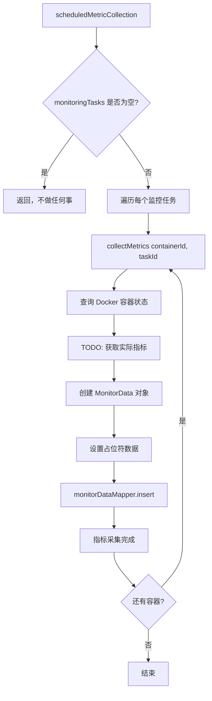
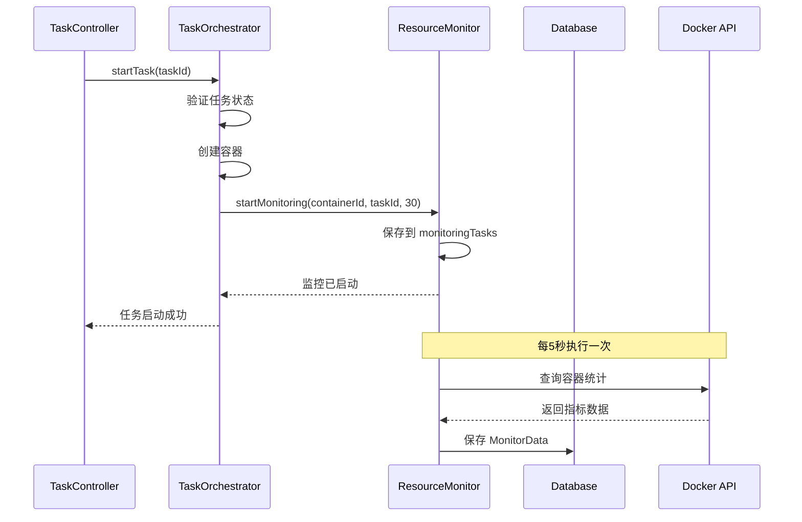
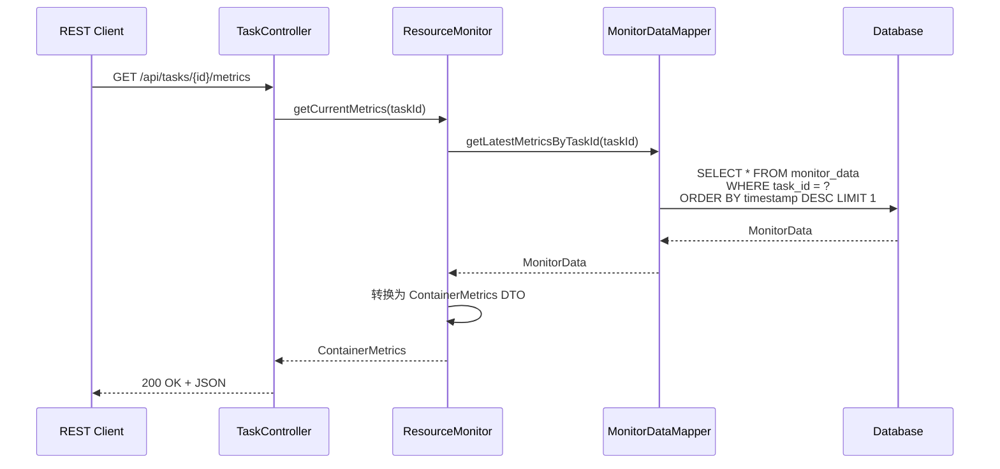

# Issue #11: Resource Monitor 实现文档

## 概述

资源监控服务负责定时采集容器的资源使用情况（CPU、内存、网络、磁盘I/O），并将数据持久化到数据库中，支持历史数据查询和当前状态查询。

## 主要实现类

### 1. ResourceMonitorImpl
**路径**: `hs-taskm-core/src/main/java/com/taskm/service/impl/ResourceMonitorImpl.java`

**职责**:
- 管理监控任务的生命周期
- 定时采集容器指标
- 存储和查询监控数据
- 清理过期历史数据

**核心方法**:
```java
void startMonitoring(String containerId, Long taskId, int intervalSeconds)
void stopMonitoring(String containerId)
boolean isMonitoring(String containerId)
MonitorData collectMetrics(String containerId, Long taskId)
ContainerMetrics getCurrentMetrics(Long taskId)
List<MonitorData> getMetricsHistory(Long taskId, LocalDateTime startTime, LocalDateTime endTime)
```

### 2. MonitorData 实体
**路径**: `hs-taskm-common/src/main/java/com/taskm/entity/MonitorData.java`

**职责**: 存储容器资源监控数据

**字段**:
- `id`: 主键
- `taskId`: 任务ID
- `containerId`: 容器ID
- `timestamp`: 采集时间戳
- `cpuUsage`: CPU使用率（百分比）
- `memoryUsage`: 内存使用量（字节）
- `memoryLimit`: 内存限制（字节）
- `memoryUsagePercent`: 内存使用率（百分比）
- `networkRxBytes`: 网络接收字节数
- `networkTxBytes`: 网络发送字节数
- `blockReadBytes`: 磁盘读取字节数
- `blockWriteBytes`: 磁盘写入字节数

### 3. MonitorDataMapper
**路径**: `hs-taskm-dao/src/main/java/com/taskm/mapper/MonitorDataMapper.java`

**职责**: 提供监控数据的数据库访问

**核心方法**:
```java
@Select("SELECT * FROM monitor_data WHERE task_id = #{taskId} ORDER BY timestamp DESC LIMIT 1")
MonitorData getLatestMetricsByTaskId(@Param("taskId") Long taskId);

@Select("SELECT * FROM monitor_data WHERE task_id = #{taskId} " +
        "AND timestamp BETWEEN #{startTime} AND #{endTime} " +
        "ORDER BY timestamp ASC")
List<MonitorData> getMetricsByTaskIdAndTimeRange(
    @Param("taskId") Long taskId,
    @Param("startTime") LocalDateTime startTime,
    @Param("endTime") LocalDateTime endTime
);
```

## 架构设计

### 分层架构

```
┌─────────────────────────────────────────────────────────┐
│                    REST API Layer                        │
│  TaskController.getMetrics(), getMetricsHistory()       │
└──────────────────────┬──────────────────────────────────┘
                       │
                       ▼
┌─────────────────────────────────────────────────────────┐
│                  Service Layer                          │
│            ResourceMonitorImpl                           │
│  - startMonitoring()                                     │
│  - collectMetrics()      ┌──────────────────────────┐   │
│  - getCurrentMetrics()   │  Scheduled Collection    │   │
│  - getMetricsHistory()   │  (@Scheduled fixedRate)  │   │
│  - cleanupOldMetrics()   └──────────────────────────┘   │
└──────────────────────┬──────────────────────────────────┘
                       │
                       ▼
┌─────────────────────────────────────────────────────────┐
│                   Data Access Layer                     │
│               MonitorDataMapper                          │
└──────────────────────┬──────────────────────────────────┘
                       │
                       ▼
┌─────────────────────────────────────────────────────────┐
│                  Database Layer                         │
│              monitor_data Table                          │
└─────────────────────────────────────────────────────────┘
```

## 核心流程图

### 1. 启动监控流程

```mermaid
flowchart TD
    A[TaskOrchestrator.startTask] --> B[ResourceMonitor.startMonitoring]
    B --> C[创建 MonitoringTask 对象]
    C --> D[添加到 monitoringTasks Map]
    D --> E[监控开始]

    E --> F["@Scheduled 定时触发]
    F --> G{遍历 monitoringTasks}
    G --> H[collectMetrics]
    H --> I[获取 Docker 容器指标]
    I --> J[保存到数据库]
    J --> K[下一个容器]
    K --> G
```

### 2. 收集指标流程



### 3. 查询历史指标流程

```mermaid
flowchart TD
    A[GET /api/tasks/{id}/metrics/history] --> B[TaskController.getTaskMetricsHistory]
    B --> C[ResourceMonitor.getMetricsHistory]
    C --> D[验证时间参数]
    D --> E[设置默认时间范围]
    E --> F[MonitorDataMapper.getMetricsByTaskIdAndTimeRange]
    F --> G[查询数据库]
    G --> H[返回 List&lt;MonitorData&gt;]
    H --> I[封装为 Result 返回]
```

## 时序图

### 1. 任务启动并开始监控



### 2. 查询任务当前指标



### 3. 查询历史指标

```mermaid
sequenceDiagram
    participant Client as REST Client
    participant API as TaskController
    participant RM as ResourceMonitor
    participant Mapper as MonitorDataMapper
    participant DB as Database

    Client->>API: GET /api/tasks/{id}/metrics/history?<br/>startTime=&endTime=
    API->>API: 设置默认时间范围（最近1小时）
    API->>RM: getMetricsHistory(taskId, start, end)
    RM->>Mapper: getMetricsByTaskIdAndTimeRange(taskId, start, end)
    Mapper->>DB: SELECT * FROM monitor_data<br/>WHERE task_id = ?<br/>AND timestamp BETWEEN ? AND ?
    DB-->>Mapper: List&lt;MonitorData&gt;
    Mapper-->>RM: List&lt;MonitorData&gt;
    RM-->>API: List&lt;MonitorData&gt;
    API-->>Client: 200 OK + JSON
```

## 主要数据结构

### 1. MonitorData (实体)

```java
@Data
@TableName("monitor_data")
public class MonitorData implements Serializable {
    @TableId(type = IdType.AUTO)
    private Long id;

    private Long taskId;
    private String containerId;
    private LocalDateTime timestamp;

    // CPU
    private Double cpuUsage;

    // Memory
    private Long memoryUsage;
    private Long memoryLimit;
    private Double memoryUsagePercent;

    // Network
    private Long networkRxBytes;
    private Long networkTxBytes;

    // Block I/O
    private Long blockReadBytes;
    private Long blockWriteBytes;
}
```

### 2. ContainerMetrics (DTO)

```java
@Data
public class ContainerMetrics {
    private String containerId;
    private Double cpuUsage;
    private Long memoryUsage;
    private Long memoryLimit;
    private Double memoryUsagePercent;
    private Long networkRxBytes;
    private Long networkTxBytes;
    private Long blockReadBytes;
    private Long blockWriteBytes;
    private LocalDateTime timestamp;
}
```

### 3. MonitoringTask (内部类)

```java
private static class MonitoringTask {
    final Long taskId;
    final int intervalSeconds;
    LocalDateTime lastCollection;

    MonitoringTask(Long taskId, int intervalSeconds) {
        this.taskId = taskId;
        this.intervalSeconds = intervalSeconds;
    }
}
```

## REST API 端点

### 1. 获取当前指标
```
GET /api/tasks/{id}/metrics
Response: Result<ContainerMetrics>
```

### 2. 获取历史指标
```
GET /api/tasks/{id}/metrics/history?startTime={ISO8601}&endTime={ISO8601}
Response: Result<List<MonitorData>>
```

## 数据库设计

### monitor_data 表

```sql
CREATE TABLE monitor_data (
    id BIGSERIAL PRIMARY KEY,
    task_id BIGINT NOT NULL,
    container_id VARCHAR(255) NOT NULL,
    timestamp TIMESTAMP NOT NULL,
    cpu_usage DOUBLE,
    memory_usage BIGINT,
    memory_limit BIGINT,
    memory_usage_percent DOUBLE,
    network_rx_bytes BIGINT,
    network_tx_bytes BIGINT,
    block_read_bytes BIGINT,
    block_write_bytes BIGINT
);

CREATE INDEX idx_monitor_task_id ON monitor_data(task_id);
CREATE INDEX idx_monitor_timestamp ON monitor_data(timestamp);
CREATE INDEX idx_monitor_task_time ON monitor_data(task_id, timestamp);
```

## 配置参数

```yaml
# application.yml
monitoring:
  default:
    interval: 30  # 默认监控间隔（秒）
  retention:
    days: 7       # 数据保留天数
  schedule:
    rate: 5000    # 定时采集频率（毫秒）
  cleanup:
    cron: "0 0 2 * * ?"  # 清理任务 cron 表达式（每天凌晨2点）
```

## 测试用例

### ResourceMonitorTest (9个测试)

| 测试用例 | 描述 | 验证点 |
|---------|------|--------|
| `testStartMonitoring_shouldAddToMonitoringTasks` | 启动监控后容器应被跟踪 | `isMonitoring()` 返回 true |
| `testStopMonitoring_shouldRemoveFromMonitoringTasks` | 停止监控后容器不应被跟踪 | `isMonitoring()` 返回 false |
| `testIsMonitoring_shouldReturnFalseForNonExistentContainer` | 不存在的容器返回 false | `isMonitoring()` 返回 false |
| `testCollectMetrics_shouldSaveMonitorDataToDatabase` | 采集的指标应保存到数据库 | `monitorDataMapper.insert()` 被调用 |
| `testCollectMetrics_shouldSetPlaceholderMetrics` | 当前使用占位符数据（TODO） | 所有指标值为 0 |
| `testGetCurrentMetrics_shouldReturnMetricsFromDatabase` | 获取最新指标并转换为 DTO | 返回正确的 ContainerMetrics |
| `testGetCurrentMetrics_shouldReturnNullWhenNoMetricsExist` | 无数据时返回 null | 返回 null |
| `testGetMetricsHistory_shouldReturnDataFromMapper` | 返回时间范围内的历史数据 | 返回正确的数据列表 |
| `testScheduledMetricCollection_shouldCollectMetricsForAllMonitoringTasks` | 定时任务应采集所有监控容器的指标 | `insert()` 被调用多次 |

## 已知限制和 TODO

### 1. Docker 统计 API 集成
**状态**: TODO

当前实现使用占位符数据（全部为0）。需要集成 Docker 实际的统计 API：

```java
// TODO: 替换为实际实现
// ContainerMetrics metrics = containerLifecycleManager.getContainerMetrics(containerId);
data.setCpuUsage(0.0);
data.setMemoryUsage(0L);
// ... 其他占位符值
```

**需要做的**:
1. 调用 `ContainerLifecycleManager.getContainerMetrics()`
2. 解析 Docker 返回的统计信息
3. 填充到 `MonitorData` 对象中

### 2. 监控间隔动态调整
当前监控间隔在启动时固定，不支持动态调整。

### 3. 多容器批量优化
当前每个容器单独查询 Docker API，可以考虑批量查询优化性能。

## 相关 Issue

- **依赖**: Issue #9 (任务启动流程) - 在任务启动后自动开始监控
- **依赖**: Issue #10 (任务停止流程) - 在任务停止后停止监控
- **使用方**: Issue #12 (Log Router) - 可与日志关联分析
