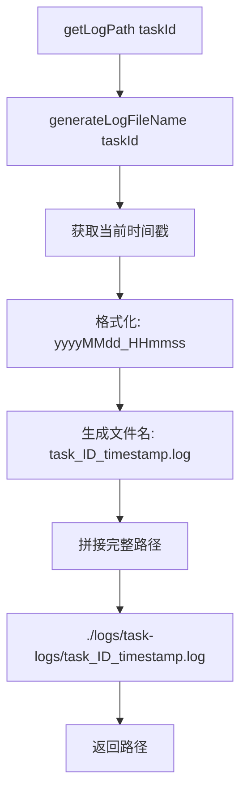
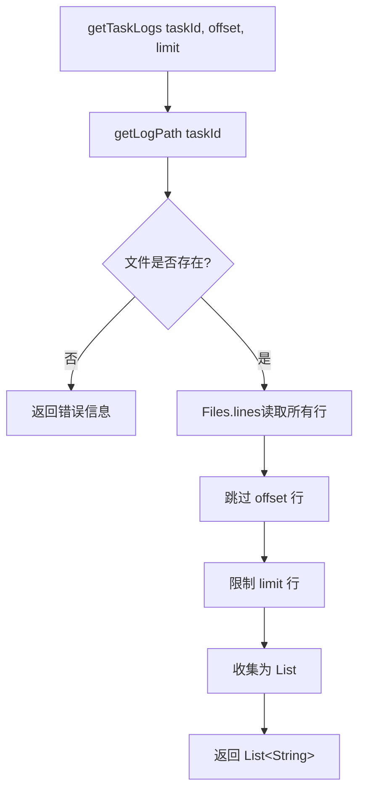
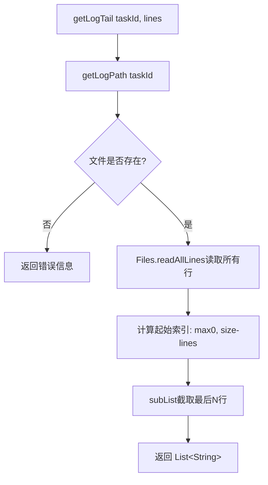
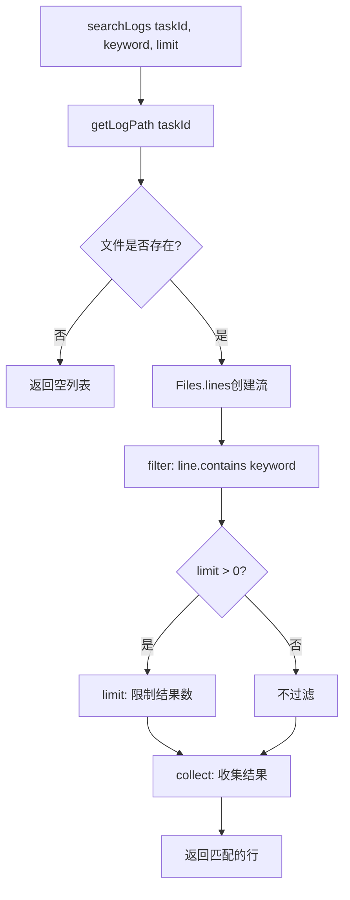
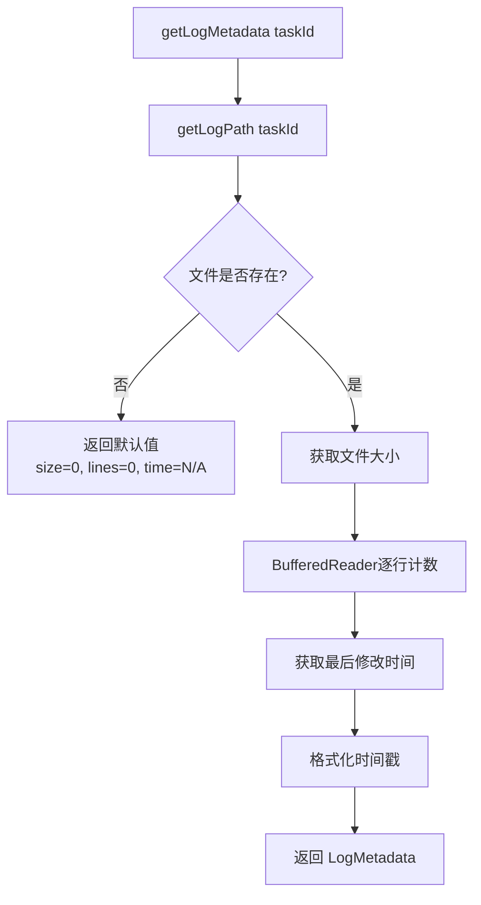
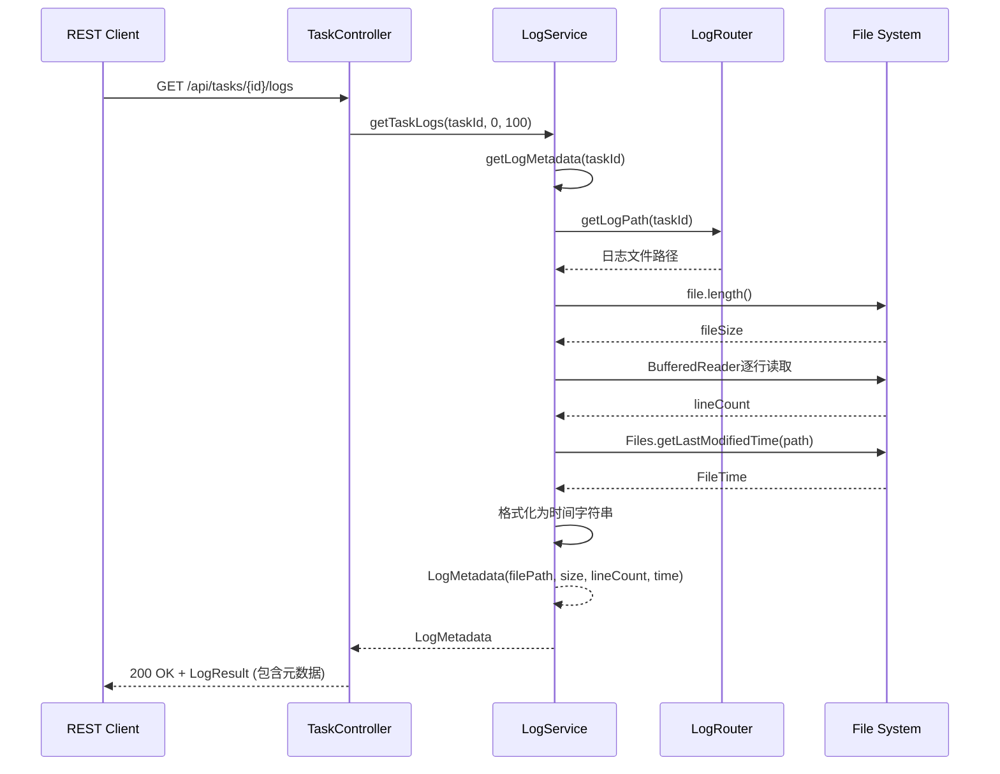

# Issue #12: Log Router 和日志查看实现文档

## 概述

日志系统提供了任务日志的路由管理、文件存储、分页查询、尾部查询和关键字搜索功能。每个任务的日志存储在独立的文件中，支持灵活的日志检索。

## 主要实现类

### 1. LogRouterImpl
**路径**: `hs-taskm-core/src/main/java/com/taskm/service/impl/LogRouterImpl.java`

**职责**:
- 生成日志文件路径
- 管理日志目录结构
- 创建日志文件名

**核心方法**:
```java
String getLogPath(Long taskId)
String generateLogFileName(Long taskId)
String ensureLogDirectoryExists()
```

**实现细节**:
```java
private static final String DEFAULT_LOG_DIR = "./logs/task-logs";

@Override
public String getLogPath(Long taskId) {
    String logFileName = generateLogFileName(taskId);
    return DEFAULT_LOG_DIR + File.separator + logFileName;
}

@Override
public String generateLogFileName(Long taskId) {
    String timestamp = LocalDateTime.now().format(
        DateTimeFormatter.ofPattern("yyyyMMdd_HHmmss")
    );
    return String.format("task_%d_%s.log", taskId, timestamp);
}
```

### 2. LogServiceImpl
**路径**: `hs-taskm-core/src/main/java/com/taskm/service/impl/LogServiceImpl.java`

**职责**:
- 读取日志文件内容
- 支持分页、尾部、搜索查询
- 获取日志文件元数据

**核心方法**:
```java
List<String> getTaskLogs(Long taskId, int offset, int limit)
List<String> getLogTail(Long taskId, int lines)
List<String> searchLogs(Long taskId, String keyword, int limit)
LogMetadata getLogMetadata(Long taskId)
```

### 3. LogMetadata (内部类)
**职责**: 封装日志文件元数据信息

**字段**:
```java
public static class LogMetadata {
    private final String filePath;
    private final long fileSize;
    private final long lineCount;
    private final String lastModified;
}
```

### 4. LogResult DTO
**路径**: `hs-taskm-common/src/main/java/com/taskm/dto/LogResult.java`

**职责**: 封装日志查询结果返回给客户端

**字段**:
- `taskId`: 任务ID
- `filePath`: 日志文件路径
- `fileSize`: 文件大小
- `lineCount`: 总行数
- `lastModified`: 最后修改时间
- `lines`: 日志内容
- `count`: 返回的行数
- `offset`: 分页偏移量
- `limit`: 分页限制

## 架构设计

### 分层架构

```
┌─────────────────────────────────────────────────────────┐
│                    REST API Layer                        │
│  TaskController                                          │
│  - getTaskLogs(offset, limit)                           │
│  - getLogTail(lines)                                     │
│  - searchLogs(keyword, limit)                           │
└──────────────────────┬──────────────────────────────────┘
                       │
                       ▼
┌─────────────────────────────────────────────────────────┐
│                  Service Layer                          │
│  ┌─────────────────────────────────────────────────┐   │
│  │           LogRouterImpl                          │   │
│  │  - getLogPath(taskId)                           │   │
│  │  - generateLogFileName(taskId)                  │   │
│  └─────────────────────────────────────────────────┘   │
│  ┌─────────────────────────────────────────────────┐   │
│  │           LogServiceImpl                        │   │
│  │  - getTaskLogs()     [分页读取]                  │   │
│  │  - getLogTail()      [尾部读取]                  │   │
│  │  - searchLogs()     [关键字搜索]                │   │
│  │  - getLogMetadata() [元数据]                    │   │
│  └─────────────────────────────────────────────────┘   │
└──────────────────────┬──────────────────────────────────┘
                       │
                       ▼
┌─────────────────────────────────────────────────────────┐
│                  File System                             │
│           ./logs/task-logs/task_<id>_<ts>.log           │
└─────────────────────────────────────────────────────────┘
```

## 核心流程图

### 1. 日志路径生成流程



### 2. 分页读取日志流程



### 3. 尾部读取日志流程



### 4. 关键字搜索流程



### 5. 获取日志元数据流程



## 时序图

### 1. 查询任务日志（分页）

```mermaid
sequenceDiagram
    participant Client as REST Client
    participant API as TaskController
    participant LS as LogService
    participant LR as LogRouter
    participant FS as File System

    Client->>API: GET /api/tasks/{id}/logs?offset=0&limit=100
    API->>LS: getTaskLogs(taskId, 0, 100)
    LS->>LR: getLogPath(taskId)
    LR-->>LS: "./logs/task-logs/task_1_20240101_120000.log"
    LS->>FS: Files.lines(path).skip(0).limit(100)
    FS-->>LS: Stream&lt;String&gt;
    LS->>LS: collect(Collectors.toList())
    LS-->>API: List&lt;String&gt; lines
    API->>API: 构建 LogResult
    API-->>Client: 200 OK + LogResult JSON
```

### 2. 查询日志尾部

```mermaid
sequenceDiagram
    participant Client as REST Client
    participant API as TaskController
    participant LS as LogService
    participant LR as LogRouter
    participant FS as File System

    Client->>API: GET /api/tasks/{id}/logs/tail?lines=50
    API->>LS: getLogTail(taskId, 50)
    LS->>LR: getLogPath(taskId)
    LR-->>LS: 日志文件路径
    LS->>FS: Files.readAllLines(path)
    FS-->>LS: List&lt;String&gt; allLines
    LS->>LS: 计算 startIndex = max(0, size - 50)
    LS->>LS: subList(startIndex, size)
    LS-->>API: List&lt;String&gt; tailLines
    API->>API: 构建 LogResult
    API-->>Client: 200 OK + LogResult JSON
```

### 3. 关键字搜索

```mermaid
sequenceDiagram
    participant Client as REST Client
    participant API as TaskController
    participant LS as LogService
    participant LR as LogRouter
    participant FS as File System

    Client->>API: GET /api/tasks/{id}/logs/search?keyword=ERROR&limit=100
    API->>LS: searchLogs(taskId, "ERROR", 100)
    LS->>LR: getLogPath(taskId)
    LR-->>LS: 日志文件路径
    LS->>FS: Files.lines(path)
    FS-->>LS: Stream&lt;String&gt;
    LS->>LS: filter(line -> line.contains("ERROR"))
    LS->>LS: limit(100)
    LS->>LS: collect(Collectors.toList())
    LS-->>API: List&lt;String&gt; matchedLines
    API->>API: 构建 LogResult
    API-->>Client: 200 OK + LogResult JSON
```

### 4. 获取日志元数据



## 主要数据结构

### 1. LogService.LogMetadata

```java
public static class LogMetadata {
    private final String filePath;      // 日志文件路径
    private final long fileSize;        // 文件大小（字节）
    private final long lineCount;       // 总行数
    private final String lastModified;  // 最后修改时间

    public LogMetadata(String filePath, long fileSize,
                     long lineCount, String lastModified) {
        this.filePath = filePath;
        this.fileSize = fileSize;
        this.lineCount = lineCount;
        this.lastModified = lastModified;
    }
}
```

### 2. LogResult DTO

```java
@Data
public class LogResult {
    private Long taskId;           // 任务ID
    private String filePath;       // 日志文件路径
    private Long fileSize;         // 文件大小
    private Long lineCount;        // 总行数
    private String lastModified;   // 最后修改时间
    private List<String> lines;    // 日志内容
    private Integer count;         // 返回的行数
    private Integer offset;        // 分页偏移
    private Integer limit;         // 分页限制

    public static LogResult of(Long taskId, String filePath, long fileSize,
                             long lineCount, String lastModified,
                             List<String> lines) {
        LogResult result = new LogResult();
        result.setTaskId(taskId);
        result.setFilePath(filePath);
        result.setFileSize(fileSize);
        result.setLineCount(lineCount);
        result.setLastModified(lastModified);
        result.setLines(lines);
        result.setCount(lines.size());
        return result;
    }
}
```

## REST API 端点

### 1. 分页查询日志
```
GET /api/tasks/{id}/logs?offset=0&limit=100
Response: Result<LogResult>
```

**说明**:
- `offset`: 起始行号（默认 0）
- `limit`: 最大返回行数（默认 100）
- 返回包含元数据和日志内容的完整结果

### 2. 获取日志尾部
```
GET /api/tasks/{id}/logs/tail?lines=50
Response: Result<LogResult>
```

**说明**:
- `lines`: 返回最后 N 行（默认 50）
- 常用于实时查看最新日志

### 3. 搜索日志
```
GET /api/tasks/{id}/logs/search?keyword=ERROR&limit=100
Response: Result<LogResult>
```

**说明**:
- `keyword`: 搜索关键字
- `limit`: 最大返回结果数（默认 100）
- 返回包含该关键字的所有日志行

## 文件系统结构

```
./logs/task-logs/
├── task_1_20240101_100000.log
├── task_1_20240101_120000.log
├── task_2_20240101_103000.log
├── task_3_20240101_110000.log
└── ...
```

**命名规则**: `task_<taskId>_<timestamp>.log`
- `taskId`: 任务ID
- `timestamp`: 文件创建时间，格式 `yyyyMMdd_HHmmss`

## 测试用例

### LogServiceTest (13个测试)

| 测试用例 | 描述 | 验证点 |
|---------|------|--------|
| `testGetTaskLogs_shouldReturnLogLinesWithOffsetAndLimit` | 分页读取日志 | 返回正确的行数和内容 |
| `testGetTaskLogs_shouldReturnAllLinesWhenNoLimit` | 不限制返回所有行 | 返回全部日志 |
| `testGetTaskLogs_shouldReturnErrorMessageWhenFileNotFound` | 文件不存在返回错误 | 返回错误信息字符串 |
| `testGetLogTail_shouldReturnLastNLines` | 获取最后N行 | 返回正确的尾部内容 |
| `testGetLogTail_shouldReturnAllLinesWhenRequestExceedsFile` | 请求行数超过文件 | 返回全部日志 |
| `testGetLogTail_shouldReturnErrorMessageWhenFileNotFound` | 文件不存在返回错误 | 返回错误信息字符串 |
| `testSearchLogs_shouldReturnMatchingLines` | 搜索关键字 | 返回所有匹配的行 |
| `testSearchLogs_shouldReturnEmptyListWhenNoMatches` | 无匹配结果 | 返回空列表 |
| `testSearchLogs_shouldRespectLimit` | 搜索结果限制 | 返回不超过limit的结果 |
| `testSearchLogs_shouldReturnEmptyListWhenFileNotFound` | 文件不存在 | 返回空列表 |
| `testGetLogMetadata_shouldReturnCorrectMetadata` | 获取文件元数据 | 返回正确的文件信息 |
| `testGetLogMetadata_shouldReturnDefaultValuesWhenFileNotFound` | 文件不存在返回默认值 | size=0, lines=0, time=N/A |
| `testGetTaskLogs_shouldHandleEmptyFile` | 处理空文件 | 返回空列表 |

## 性能考虑

### 1. 大文件读取
- **分页读取**: 使用 `Files.lines().skip().limit()` 流式处理，避免加载整个文件到内存
- **尾部读取**: `Files.readAllLines()` 会读取整个文件，对于大文件建议优化为随机访问

### 2. 搜索优化
- 当前使用 `contains()` 顺序搜索，时间复杂度 O(n*m)
- 对于频繁搜索，可以考虑：
  - 建立索引（如 Elasticsearch）
  - 使用更高效的搜索算法（如 Boyer-Moore）

### 3. 并发访问
- 当前实现使用 Java NIO，文件读取是线程安全的
- 多个线程可以同时读取同一个日志文件

## 扩展性设计

### 1. 支持日志轮转
可以扩展为按大小或时间自动轮转日志：

```java
// 伪代码
if (fileSize > MAX_SIZE) {
    rotateLog(taskId);
}
```

### 2. 支持日志压缩
可以对历史日志进行压缩存储：

```java
// 压缩旧日志
gzip("./logs/task-logs/task_1_20240101_100000.log");
```

### 3. 支持日志级别过滤
可以在搜索时添加日志级别过滤：

```java
List<String> searchLogs(Long taskId, String keyword, LogLevel level, int limit) {
    return Files.lines(path)
        .filter(line -> line.contains(keyword))
        .filter(line -> line.contains(level.toString()))
        .limit(limit)
        .collect(Collectors.toList());
}
```

## 使用示例

### cURL 示例

```bash
# 分页查询日志
curl "http://localhost:8080/api/tasks/1/logs?offset=0&limit=100"

# 获取最后50行
curl "http://localhost:8080/api/tasks/1/logs/tail?lines=50"

# 搜索包含"ERROR"的日志
curl "http://localhost:8080/api/tasks/1/logs/search?keyword=ERROR&limit=100"
```

### 响应示例

```json
{
  "code": 200,
  "message": "success",
  "data": {
    "taskId": 1,
    "filePath": "./logs/task-logs/task_1_20240101_120000.log",
    "fileSize": 1024,
    "lineCount": 50,
    "lastModified": "2024-01-01 12:00:00",
    "lines": [
      "2024-01-01 10:00:00 INFO Task started",
      "2024-01-01 10:00:01 DEBUG Processing data",
      "2024-01-01 10:00:02 ERROR An error occurred"
    ],
    "count": 3,
    "offset": 0,
    "limit": 100
  }
}
```

## 相关 Issue

- **关联**: Issue #11 (Resource Monitor) - 日志可与监控数据关联分析
- **使用方**: Issue #9 (任务启动流程) - 启动后生成日志文件路径
- **使用方**: Issue #10 (任务停止流程) - 停止后日志可能归档
