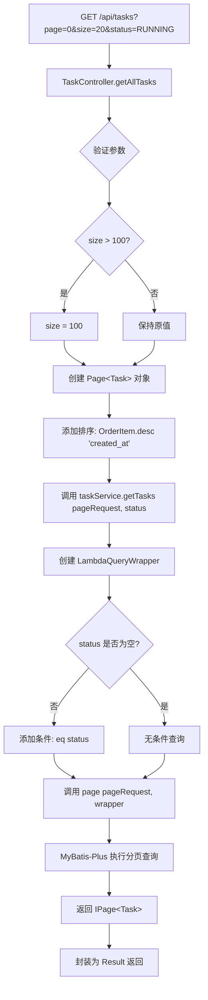
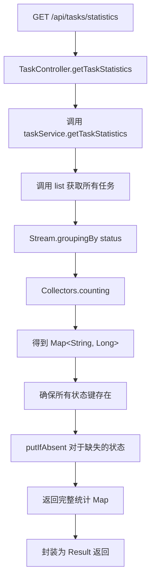
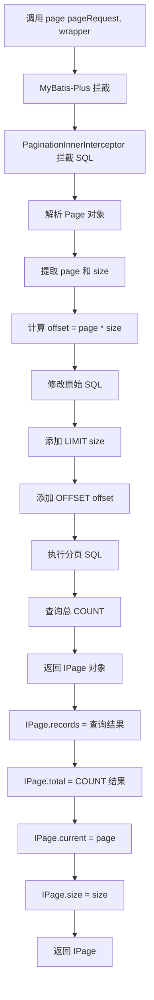

# Issue #13: 任务状态查询实现文档

## 概述

任务状态查询功能提供了灵活的任务列表查询接口，支持分页、状态筛选和多字段排序。同时提供了任务统计接口，可以快速获取各状态任务的数量分布。

## 主要实现类

### 1. MybatisPlusConfig
**路径**: `hs-taskm-service/src/main/java/com/taskm/config/MybatisPlusConfig.java`

**职责**: 配置 MyBatis-Plus 分页插件

**实现**:
```java
@Configuration
public class MybatisPlusConfig {

    @Bean
    public MybatisPlusInterceptor mybatisPlusInterceptor() {
        MybatisPlusInterceptor interceptor = new MybatisPlusInterceptor();

        // 添加 PostgreSQL 分页拦截器
        PaginationInnerInterceptor paginationInterceptor =
            new PaginationInnerInterceptor(DbType.POSTGRE_SQL);
        interceptor.addInnerInterceptor(paginationInterceptor);

        return interceptor;
    }
}
```

**关键点**:
- 使用 `DbType.POSTGRE_SQL` 配置数据库方言
- 分页拦截器会自动在 SQL 查询中添加 `LIMIT` 和 `OFFSET`

### 2. TaskService 接口扩展
**路径**: `hs-taskm-service/src/main/java/com/taskm/service/TaskService.java`

**新增方法**:
```java
// 基础分页查询
IPage<Task> getTasksWithPagination(int page, int size);

// 带状态筛选的分页查询
IPage<Task> getTasksWithPagination(int page, int size, String status);

// 灵活的分页查询（支持自定义 Page 对象）
IPage<Task> getTasks(Page<Task> pageRequest, String status);

// 获取任务统计信息
Map<String, Long> getTaskStatistics();
```

### 3. TaskServiceImpl 实现
**路径**: `hs-taskm-service/src/main/java/com/taskm/service/impl/TaskServiceImpl.java`

**核心实现**:

#### 分页查询实现
```java
@Override
public IPage<Task> getTasks(Page<Task> pageRequest, String status) {
    LambdaQueryWrapper<Task> queryWrapper = new LambdaQueryWrapper<>();
    if (status != null && !status.isEmpty()) {
        queryWrapper.eq(Task::getStatus, status);
    }
    return page(pageRequest, queryWrapper);
}
```

#### 统计功能实现
```java
@Override
public Map<String, Long> getTaskStatistics() {
    List<Task> allTasks = list();

    Map<String, Long> statistics = allTasks.stream()
        .collect(Collectors.groupingBy(Task::getStatus, Collectors.counting()));

    // 确保所有状态都存在（即使为0）
    statistics.putIfAbsent("PENDING", 0L);
    statistics.putIfAbsent("CREATED", 0L);
    statistics.putIfAbsent("RUNNING", 0L);
    statistics.putIfAbsent("STOPPED", 0L);
    statistics.putIfAbsent("FAILED", 0L);
    statistics.putIfAbsent("COMPLETED", 0L);

    return statistics;
}
```

### 4. TaskController REST API
**路径**: `hs-taskm-api/src/main/java/com/taskm/controller/TaskController.java`

**API 端点**:

#### 1. 分页查询任务列表
```java
@GetMapping
public Result<IPage<Task>> getAllTasks(
    @RequestParam(defaultValue = "0") int page,
    @RequestParam(defaultValue = "20") int size,
    @RequestParam(required = false) String status,
    @RequestParam(defaultValue = "createdAt") String sort
) {
    // 限制最大页面大小
    if (size > 100) {
        size = 100;
    }

    Page<Task> pageRequest = new Page<>(page, size);

    // 设置排序（降序）
    String dbColumn = switch (sort) {
        case "createdAt" -> "created_at";
        case "startedAt" -> "started_at";
        case "completedAt" -> "completed_at";
        default -> "created_at";
    };
    pageRequest.addOrder(OrderItem.desc(dbColumn));

    IPage<Task> tasks = taskService.getTasks(pageRequest, status);
    return Result.success(tasks);
}
```

#### 2. 获取任务统计
```java
@GetMapping("/statistics")
public Result<Map<String, Long>> getTaskStatistics() {
    Map<String, Long> statistics = taskService.getTaskStatistics();
    return Result.success(statistics);
}
```

## 架构设计

### 分层架构

```
┌─────────────────────────────────────────────────────────┐
│                    REST API Layer                        │
│  TaskController                                          │
│  - GET /api/tasks?page=0&size=20&status=RUNNING        │
│  - GET /api/tasks/statistics                             │
└──────────────────────┬──────────────────────────────────┘
                       │
                       ▼
┌─────────────────────────────────────────────────────────┐
│                  Service Layer                          │
│  TaskServiceImpl extends ServiceImpl<Task, TaskMapper> │
│  - getTasks(Page, status)                               │
│  - getTaskStatistics()                                  │
└──────────────────────┬──────────────────────────────────┘
                       │
                       ▼
┌─────────────────────────────────────────────────────────┐
│                  MyBatis-Plus                           │
│  - PaginationInnerInterceptor (PostgreSQL)             │
│  - BaseMapper.paginate(Page, Wrapper)                  │
└──────────────────────┬──────────────────────────────────┘
                       │
                       ▼
┌─────────────────────────────────────────────────────────┐
│                  Database Layer                         │
│              SELECT ... FROM task                       │
│              WHERE status = ?                           │
│              ORDER BY created_at DESC                   │
│              LIMIT ? OFFSET ?                          │
└─────────────────────────────────────────────────────────┘
```

## 核心流程图

### 1. 分页查询流程



### 2. 统计查询流程



### 3. MyBatis-Plus 分页拦截器工作流程



## 时序图

### 1. 分页查询任务列表

```mermaid
sequenceDiagram
    participant Client as REST Client
    participant API as TaskController
    participant Service as TaskService
    participant MP as MyBatis-Plus
    participant DB as Database

    Client->>API: GET /api/tasks?page=0&size=20&status=RUNNING
    API->>API: 验证 size <= 100
    API->>API: 创建 Page(0, 20)
    API->>API: 添加排序 OrderItem.desc("created_at")
    API->>Service: getTasks(pageRequest, "RUNNING")
    Service->>Service: 创建 LambdaQueryWrapper
    Service->>Service: wrapper.eq(Task::getStatus, "RUNNING")
    Service->>MP: page(pageRequest, wrapper)
    MP->>MP: 拦截并添加分页 SQL
    MP->>DB: SELECT * FROM task<br/>WHERE status = 'RUNNING'<br/>ORDER BY created_at DESC<br/>LIMIT 20 OFFSET 0
    DB-->>MP: 结果集
    MP->>DB: SELECT COUNT(*) FROM task<br/>WHERE status = 'RUNNING'
    DB-->>MP: 总数
    MP-->>Service: IPage&lt;Task&gt;
    Service-->>API: IPage&lt;Task&gt;
    API-->>Client: Result&lt;IPage&lt;Task&gt;
```

### 2. 获取任务统计

```mermaid
sequenceDiagram
    participant Client as REST Client
    participant API as TaskController
    participant Service as TaskService
    participant Mapper as TaskMapper
    participant DB as Database

    Client->>API: GET /api/tasks/statistics
    API->>Service: getTaskStatistics()
    Service->>Mapper: list()
    Mapper->>DB: SELECT * FROM task
    DB-->>Mapper: List&lt;Task&gt;
    Mapper-->>Service: List&lt;Task&gt;
    Service->>Service: stream().collect(groupingBy(status, counting))
    Service->>Service: putIfAbsent 确保所有状态存在
    Service-->>API: Map&lt;String, Long&gt;
    API-->>Client: Result&lt;Map&gt;
```

## 主要数据结构

### 1. IPage<Task> (MyBatis-Plus)

```java
// MyBatis-Plus 提供的分页结果对象
public interface IPage<T> {
    List<T> getRecords();     // 当前页数据
    long getTotal();          // 总记录数
    long getCurrent();         // 当前页码
    long getSize();           // 每页大小
    long getPages();          // 总页数
}
```

**示例响应**:
```json
{
  "records": [
    {"id": 1, "status": "RUNNING", "createdAt": "2024-01-01T10:00:00"},
    {"id": 2, "status": "RUNNING", "createdAt": "2024-01-01T09:00:00"}
  ],
  "total": 45,
  "current": 0,
  "size": 20,
  "pages": 3
}
```

### 2. Map<String, Long> (统计结果)

```java
// 统计结果：状态 -> 数量
{
  "PENDING": 5,
  "CREATED": 10,
  "RUNNING": 15,
  "STOPPED": 8,
  "FAILED": 3,
  "COMPLETED": 4
}
```

### 3. OrderItem (MyBatis-Plus)

```java
// 排序项
OrderItem orderItem = OrderItem.desc("created_at");
// 或
OrderItem orderItem = OrderItem.asc("created_at");

pageRequest.addOrder(orderItem);
```

## REST API 端点

### 1. 分页查询任务列表
```
GET /api/tasks?page=0&size=20&status=RUNNING&sort=createdAt
```

**参数**:
- `page`: 页码（从 0 开始，默认 0）
- `size`: 每页大小（默认 20，最大 100）
- `status`: 状态筛选（可选：PENDING, CREATED, RUNNING, STOPPED, FAILED, COMPLETED）
- `sort`: 排序字段（可选：createdAt, startedAt, completedAt，默认降序）

**响应**:
```json
{
  "code": 200,
  "message": "success",
  "data": {
    "records": [...],
    "total": 45,
    "current": 0,
    "size": 20,
    "pages": 3
  }
}
```

### 2. 获取任务统计
```
GET /api/tasks/statistics
```

**响应**:
```json
{
  "code": 200,
  "message": "success",
  "data": {
    "PENDING": 5,
    "CREATED": 10,
    "RUNNING": 15,
    "STOPPED": 8,
    "FAILED": 3,
    "COMPLETED": 4
  }
}
```

## 数据库查询

### 生成的 SQL 示例

#### 分页查询
```sql
-- 查询第1页，每页20条，状态为 RUNNING，按创建时间降序
SELECT * FROM task
WHERE status = 'RUNNING'
ORDER BY created_at DESC
LIMIT 20 OFFSET 0;
```

#### 统计查询
```sql
-- MyBatis-Plus 自动生成的统计查询
SELECT COUNT(*) FROM task;
SELECT * FROM task;
-- 然后在内存中按 status 分组统计
```

## 测试用例

### TaskServiceTest 新增测试 (6个)

| 测试用例 | 描述 | 验证点 |
|---------|------|--------|
| `canGetTasksWithPagination` | 基础分页查询 | 返回正确的页码、大小、总数 |
| `canGetTasksWithPaginationAndStatusFilter` | 带状态筛选的分页 | 返回符合状态的任务 |
| `canGetTasksWithFlexiblePagination` | 使用 Page 对象查询 | 支持灵活的查询参数 |
| `canGetTaskStatistics` | 获取任务统计 | 返回所有状态及正确计数 |
| `canGetTaskStatisticsWithEmptyDatabase` | 空数据库统计 | 所有状态计数为 0 |

## 性能优化

### 1. 索引建议

```sql
-- 为常用查询字段添加索引
CREATE INDEX idx_task_status ON task(status);
CREATE INDEX idx_task_created_at ON task(created_at);
CREATE INDEX idx_task_status_created ON task(status, created_at);
```

### 2. 统计查询优化

当前实现使用内存分组 `stream().collect(groupingBy())`，对于大量数据可以优化：

**方案 1**: 数据库聚合
```sql
SELECT status, COUNT(*) as count
FROM task
GROUP BY status;
```

**方案 2**: 缓存统计结果
```java
@Cacheable("taskStatistics")
public Map<String, Long> getTaskStatistics() {
    // ...
}
```

### 3. 大数据量分页优化

对于深度分页（offset 很大），可以使用基于游标的分页：

```java
// 替代 offset 分页
WHERE id > lastId
ORDER BY id
LIMIT size;
```

## 扩展性设计

### 1. 支持多状态筛选

可以扩展为支持多个状态：

```java
@GetMapping
public Result<IPage<Task>> getAllTasks(
    @RequestParam(required = false) List<String> statuses
) {
    // 支持 status=RUNNING,STOPPED
    queryWrapper.in(Task::getStatus, statuses);
}
```

### 2. 支持多字段排序

```java
@GetMapping
public Result<IPage<Task>> getAllTasks(
    @RequestParam(defaultValue = "createdAt") List<String> sort
) {
    // 支持 sort=createdAt,status,startedAt
    for (String field : sort) {
        pageRequest.addOrder(OrderItem.desc(toDbColumn(field)));
    }
}
```

### 3. 支持更多筛选条件

```java
@GetMapping
public Result<IPage<Task>> getAllTasks(
    @RequestParam(required = false) Long strategyId,
    @RequestParam(required = false) LocalDateTime startTime,
    @RequestParam(required = false) LocalDateTime endTime
) {
    // 按策略ID筛选
    if (strategyId != null) {
        queryWrapper.eq(Task::getStrategyId, strategyId);
    }
    // 按时间范围筛选
    if (startTime != null) {
        queryWrapper.ge(Task::getCreatedAt, startTime);
    }
    if (endTime != null) {
        queryWrapper.le(Task::getCreatedAt, endTime);
    }
}
```

## 使用示例

### cURL 示例

```bash
# 查询第1页，每页20条
curl "http://localhost:8080/api/tasks?page=0&size=20"

# 查询 RUNNING 状态的任务
curl "http://localhost:8080/api/tasks?status=RUNNING"

# 按启动时间降序排序
curl "http://localhost:8080/api/tasks?sort=startedAt"

# 查询任务统计
curl "http://localhost:8080/api/tasks/statistics"
```

### 前端集成示例

```javascript
// React + Axios 示例
async function fetchTasks(page = 0, size = 20, status = null) {
  const params = { page, size };
  if (status) params.status = status;

  const response = await axios.get('/api/tasks', { params });
  return response.data.data; // IPage<Task>
}

async function fetchStatistics() {
  const response = await axios.get('/api/tasks/statistics');
  return response.data.data; // Map<String, Long>
}
```

## 相关 Issue

- **前置**: Issue #6 (任务创建和持久化) - 创建的任务数据用于查询
- **关联**: Issue #9 (任务启动流程) - 启动后状态变为 RUNNING
- **关联**: Issue #10 (任务停止流程) - 停止后状态变为 STOPPED
- **使用方**: Issue #14 (CLI 工具) - CLI 调用此 API 查询任务
