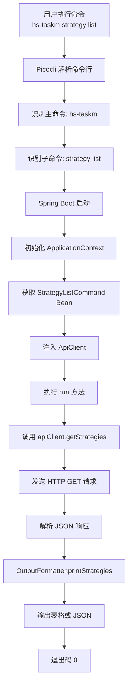
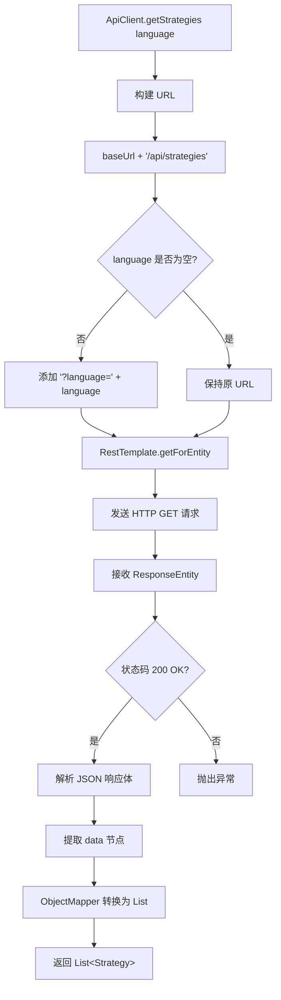
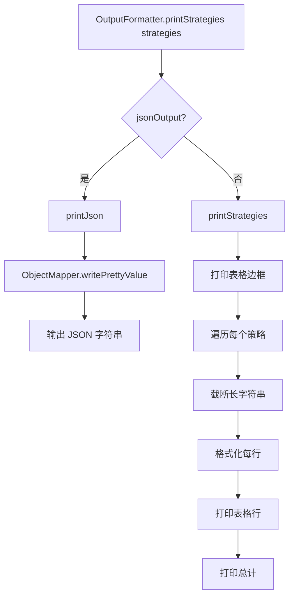
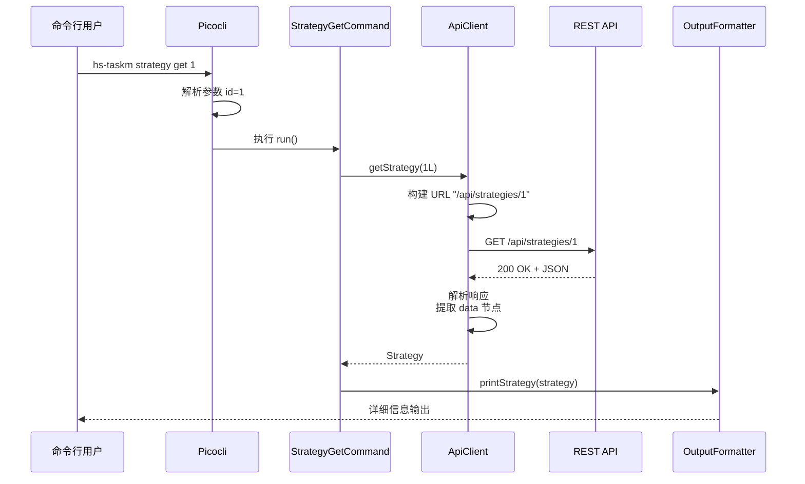

# Issue #14: CLI 工具 - 查询命令实现文档

## 概述

CLI（命令行界面）工具提供了通过命令行查询策略、插件、监听器和任务状态的功能。使用 Picocli 框架实现，支持表格和 JSON 两种输出格式，方便人类阅读和脚本解析。

## 主要实现类

### 1. HsTaskmCommand（主命令）
**路径**: `hs-taskm-cli/src/main/java/com/taskm/cli/HsTaskmCommand.java`

**职责**: CLI 工具的入口点，定义主命令和全局选项

**核心代码**:
```java
@Component
@Command(
    name = "hs-taskm",
    mixinStandardHelpOptions = true,
    version = "hs-taskm CLI 1.0.0-SNAPSHOT",
    description = "Command-line interface for HS-TASKM",
    subcommands = {
        StrategyCommand.class,
        TaskCommand.class
    }
)
public class HsTaskmCommand implements Runnable {
    @Option(names = {"-v", "--verbose"}, description = "Verbose output")
    private boolean verbose;

    @Option(names = {"--json"}, description = "Output in JSON format")
    private boolean jsonOutput;

    @Override
    public void run() {
        // 显示帮助信息
        CommandLine cmd = new CommandLine(this);
        cmd.usage(System.out);
    }
}
```

### 2. StrategyCommand（策略查询命令）
**路径**: `hs-taskm-cli/src/main/java/com/taskm/cli/StrategyCommand.java`

**职责**: 提供策略相关的查询子命令

**子命令**:
- `strategy list` - 查询所有策略
- `strategy get <id>` - 查询策略详情

**核心代码**:
```java
@Component
@Command(
    name = "strategy",
    mixinStandardHelpOptions = true,
    description = "Query strategy information",
    subcommands = {StrategyListCommand.class, StrategyGetCommand.class}
)
public class StrategyCommand implements Runnable {
    @Autowired
    private ApiClient apiClient;

    @Override
    public void run() {
        CommandLine cmd = new CommandLine(this);
        cmd.usage(System.out);
    }
}

@Component
@Command(name = "list", description = "List all strategies")
class StrategyListCommand implements Runnable {
    @Autowired
    private ApiClient apiClient;

    @Option(names = {"--language"}, description = "Filter by language")
    private String language;

    @Option(names = {"--json"}, description = "Output in JSON format")
    private boolean jsonOutput;

    @Override
    public void run() {
        List<Strategy> strategies = apiClient.getStrategies(language);
        if (jsonOutput) {
            OutputFormatter.printJson(strategies);
        } else {
            OutputFormatter.printStrategies(strategies);
        }
    }
}
```

### 3. TaskCommand（任务查询命令）
**路径**: `hs-taskm-cli/src/main/java/com/taskm/cli/TaskCommand.java`

**职责**: 提供任务相关的查询子命令

**子命令**:
- `task list` - 查询所有任务
- `task status <id>` - 查询任务详情

**核心代码**:
```java
@Component
@Command(
    name = "task",
    mixinStandardHelpOptions = true,
    description = "Query task information",
    subcommands = {TaskListCommand.class, TaskStatusCommand.class}
)
public class TaskCommand implements Runnable {
    @Autowired
    private ApiClient apiClient;

    @Override
    public void run() {
        picocli.CommandLine cmd = new picocli.CommandLine(this);
        cmd.usage(System.out);
    }
}

@Component
@Command(name = "list", description = "List all tasks")
class TaskListCommand implements Runnable {
    @Autowired
    private ApiClient apiClient;

    @Option(names = {"--status"}, description = "Filter by status")
    private String status;

    @Option(names = {"--page"}, description = "Page number (default: 0)")
    private int page;

    @Option(names = {"--size"}, description = "Page size (default: 20)")
    private int size;

    @Option(names = {"--json"}, description = "Output in JSON format")
    private boolean jsonOutput;

    @Override
    public void run() {
        List<Task> tasks = apiClient.getTasks(status, page, size);
        if (jsonOutput) {
            OutputFormatter.printJson(tasks);
        } else {
            OutputFormatter.printTasks(tasks);
        }
    }
}
```

### 4. ApiClient（REST API 客户端）
**路径**: `hs-taskm-cli/src/main/java/com/taskm/cli/service/ApiClient.java`

**职责**: 封装与后端 REST API 的通信

**核心方法**:
```java
@Component
public class ApiClient {
    private final RestTemplate restTemplate;
    private final ObjectMapper objectMapper;
    private final String baseUrl;

    // 获取所有策略
    public List<Strategy> getStrategies(String language)

    // 获取策略详情
    public Strategy getStrategy(Long id)

    // 获取任务列表
    public List<Task> getTasks(String status, int page, int size)

    // 获取任务详情
    public Task getTask(Long id)
}
```

**实现细节**:
```java
public List<Strategy> getStrategies(String language) {
    String url = baseUrl + "/api/strategies";
    if (language != null && !language.isEmpty()) {
        url += "?language=" + language;
    }

    ResponseEntity<String> response = restTemplate.getForEntity(url, String.class);

    if (response.getStatusCode() == HttpStatus.OK) {
        var jsonNode = objectMapper.readTree(response.getBody());
        var dataNode = jsonNode.get("data");
        return objectMapper.convertValue(dataNode,
            new TypeReference<List<Strategy>>() {});
    } else {
        throw new RuntimeException("API call failed");
    }
}
```

### 5. OutputFormatter（输出格式化器）
**路径**: `hs-taskm-cli/src/main/java/com/taskm/cli/service/OutputFormatter.java`

**职责**: 格式化输出数据为表格或 JSON

**核心方法**:
```java
public static void printJson(Object obj)
public static void printStrategies(List<Strategy> strategies)
public static void printStrategy(Strategy strategy)
public static void printTasks(List<Task> tasks)
public static void printTask(Task task)
```

**表格输出示例**:
```
┌────┬─────────────┬──────────┬────────────────────────────────┬─────────────────────────────┐
│ ID │ Name        │ Language │ Description                    │ Created At                   │
├────┼─────────────┼──────────┼────────────────────────────────┼─────────────────────────────┤
│  1 │ python-strat│ python   │ Python trading strategy         │ 2024-01-01 10:00:00        │
└────┴─────────────┴──────────┴────────────────────────────────┴─────────────────────────────┘
```

### 6. HsTaskmCliApplication（Spring Boot 入口）
**路径**: `hs-taskm-cli/src/main/java/com/taskm/cli/HsTaskmCliApplication.java`

**职责**: Spring Boot 应用启动类，初始化 CLI 命令执行

**核心代码**:
```java
@SpringBootApplication
public class HsTaskmCliApplication {

    public static void main(String[] args) {
        ApplicationContext context = SpringApplication.run(
            HsTaskmCliApplication.class, args
        );

        HsTaskmCommand command = context.getBean(HsTaskmCommand.class);
        CommandLine cmd = new CommandLine(command);
        int exitCode = cmd.execute(args);

        System.exit(exitCode);
    }
}
```

## 架构设计

### CLI 工具架构

```
┌─────────────────────────────────────────────────────────┐
│                    命令行用户                            │
│  $ hs-taskm strategy list --language=python              │
└──────────────────────┬──────────────────────────────────┘
                       │
                       ▼
┌─────────────────────────────────────────────────────────┐
│                  Picocli 框架                            │
│  - 解析命令行参数                                         │
│  - 匹配子命令                                             │
│  - 验证参数                                               │
└──────────────────────┬──────────────────────────────────┘
                       │
                       ▼
┌─────────────────────────────────────────────────────────┐
│              Spring Boot 应用上下文                       │
│  HsTaskmCliApplication.main()                            │
│  - 初始化 ApplicationContext                               │
│  - 注入 @Component Bean                                  │
└──────────────────────┬──────────────────────────────────┘
                       │
                       ▼
┌─────────────────────────────────────────────────────────┐
│              命令类（@Command 注解）                      │
│  StrategyCommand, TaskCommand                          │
│  - StrategyListCommand                                  │
│  - TaskListCommand                                       │
└──────────────────────┬──────────────────────────────────┘
                       │
                       ▼
┌─────────────────────────────────────────────────────────┐
│              ApiClient（REST 客户端）                    │
│  RestTemplate + ObjectMapper                           │
│  - getStrategies()                                       │
│  - getTasks()                                            │
└──────────────────────┬──────────────────────────────────┘
                       │
                       ▼
┌─────────────────────────────────────────────────────────┐
│                  OutputFormatter                         │
│  - printJson()                                           │
│  - printStrategies()                                     │
│  - printTasks()                                          │
└──────────────────────┬──────────────────────────────────┘
                       │
                       ▼
┌─────────────────────────────────────────────────────────┐
│                    HTTP 请求                             │
│  GET http://localhost:8080/api/strategies               │
│  GET http://localhost:8080/api/tasks?status=RUNNING      │
└──────────────────────┬──────────────────────────────────┘
                       │
                       ▼
┌─────────────────────────────────────────────────────────┐
│                后端 REST API 服务                        │
│  hs-taskm-api 模块                                      │
└─────────────────────────────────────────────────────────┘
```

## 核心流程图

### 1. CLI 命令执行流程



### 2. API 调用流程



### 3. 输出格式化流程



## 时序图

### 1. 查询策略列表

```mermaid
sequenceDiagram
    participant User as 命令行用户
    participant Picocli as Picocli
    participant Cmd as StrategyListCommand
    participant Client as ApiClient
    participant API as REST API
    participant Fmt as OutputFormatter

    User->>Picocli: hs-taskm strategy list --language=python
    Picocli->>Picocli: 解析参数
    Picocli->>Cmd: 执行 run()
    Cmd->>Client: getStrategies("python")
    Client->>Client: 构建 URL + "?language=python"
    Client->>API: GET /api/strategies?language=python
    API-->>Client: 200 OK + JSON
    Client->>Client: 解析响应<br/>提取 data 节点
    Client-->>Cmd: List&lt;Strategy&gt;
    Cmd->>Fmt: printStrategies(strategies)
    Fmt->>Fmt: 绘制表格
    Fmt-->>User: 表格输出
```

### 2. 查询任务列表

```mermaid
sequenceDiagram
    participant User as 命令行用户
    participant Picocli as Picocli
    participant Cmd as TaskListCommand
    participant Client as ApiClient
    participant API as REST API
    participant Fmt as OutputFormatter

    User->>Picocli: hs-taskm task list --status=RUNNING --page=0
    Picocli->>Picocli: 解析参数
    Picocli->>Cmd: 执行 run()
    Cmd->>Client: getTasks("RUNNING", 0, 20)
    Client->>Client: 构建 URL<br/>"?page=0&size=20&status=RUNNING"
    Client->>API: GET /api/tasks?page=0&size=20&status=RUNNING
    API-->>Client: 200 OK + JSON
    Client->>Client: 解析响应<br/>提取 data.records 节点
    Client-->>Cmd: List&lt;Task&gt;
    Cmd->>Fmt: printTasks(tasks)
    Fmt->>Fmt: 绘制表格
    Fmt-->>User: 表格输出
```

### 3. 查询策略详情



## 主要数据结构

### 1. 命令行参数结构

```
hs-taskm [全局选项] <主命令> [子命令选项]

全局选项:
  -v, --verbose    详细输出
  --json           JSON 格式输出

主命令:
  strategy         策略查询
    list           查询所有策略
      --language   按语言筛选
      --json       JSON 输出
    get <id>       查询策略详情
      --json       JSON 输出

  task             任务查询
    list           查询所有任务
      --status     按状态筛选
      --page       页码
      --size       每页大小
      --json       JSON 输出
    status <id>    查询任务详情
      --json       JSON 输出
```

### 2. API 响应格式

后端 REST API 统一返回格式：
```json
{
  "code": 200,
  "message": "success",
  "data": [...]
}
```

ApiClient 需要提取 `data` 节点并反序列化。

### 3. 表格输出数据

```
┌────┬─────────────┬──────────┬────────────────────────────────┬─────────────────────────────┐
│ ID │ Name        │ Language │ Description                    │ Created At                   │
├────┼─────────────┼──────────┼────────────────────────────────┼─────────────────────────────┤
│  1 │ strat-name  │ python   │ Strategy description...       │ 2024-01-01 10:00:00        │
└────┴─────────────┴──────────┴────────────────────────────────┴─────────────────────────────┘
Total: 1 strategies
```

## 命令使用示例

### 1. 查询策略

```bash
# 查询所有策略
hs-taskm strategy list

# 按语言筛选
hs-taskm strategy list --language=python

# 输出 JSON 格式
hs-taskm strategy list --json

# 查询策略详情
hs-taskm strategy get 1
hs-taskm strategy get 1 --json
```

### 2. 查询任务

```bash
# 查询所有任务
hs-taskm task list

# 按状态筛选
hs-taskm task list --status=RUNNING

# 分页查询
hs-taskm task list --page=0 --size=10

# 组合参数
hs-taskm task list --status=FAILED --page=0 --size=20

# 输出 JSON 格式
hs-taskm task list --json

# 查询任务详情
hs-taskm task status 1
hs-taskm task status 1 --json
```

### 3. 帮助信息

```bash
# 查看主命令帮助
hs-taskm --help

# 查看子命令帮助
hs-taskm strategy --help
hs-taskm task --help
hs-taskm strategy list --help
```

## 配置文件

### application.properties

```properties
# API Base URL
api.base-url=http://localhost:8080

# Logging
logging.level.root=INFO
logging.level.com.taskm.cli=DEBUG

# Disable Spring Boot banner
spring.main.banner-mode=off

# Disable web server (CLI doesn't need it)
spring.main.web-application-type=none
```

## 输出格式示例

### 表格输出（默认）

**策略列表**:
```
┌────┬─────────────┬──────────┬────────────────────────────────┬─────────────────────────────┐
│ ID │ Name        │ Language │ Description                    │ Created At                   │
├────┼─────────────┼──────────┼────────────────────────────────┼─────────────────────────────┤
│  1 │ python-strat│ python   │ Python trading strategy         │ 2024-01-01 10:00:00        │
│  2 │ java-strat │ java     │ Java trading strategy           │ 2024-01-01 11:00:00        │
└────┴─────────────┴──────────┴────────────────────────────────┴─────────────────────────────┘
Total: 2 strategies
```

**任务列表**:
```
┌────┬────────┬─────────┬────────────┬─────────────┬─────────────────────────────┐
│ ID │ Status │ Strategy│ Started At  │ Completed At│ Created At                   │
├────┼────────┼─────────┼────────────┼─────────────┼─────────────────────────────┤
│  1 │ RUNNING│    1    │ 10:00:00    │ N/A         │ 2024-01-01 09:00:00        │
│  2 │ STOPPED │    1    │ 11:00:00    │ 11:30:00    │ 2024-01-01 09:05:00        │
└────┴────────┴─────────┴────────────┴─────────────┴─────────────────────────────┘
Total: 2 tasks
```

### JSON 输出（--json）

**策略列表**:
```json
[ {
  "id": 1,
  "name": "python-strat",
  "language": "python",
  "description": "Python trading strategy",
  "code": "def strategy(): pass",
  "createdAt": "2024-01-01T10:00:00"
} ]
```

**任务详情**:
```json
{
  "id": 1,
  "strategyId": 1,
  "status": "RUNNING",
  "containerId": "abc123",
  "createdAt": "2024-01-01T09:00:00",
  "startedAt": "2024-01-01T10:00:00",
  "completedAt": null,
  "parameters": {
    "strategyId": 1,
    "strategyParams": {}
  }
}
```

## 模块依赖

```
hs-taskm-cli
├── hs-taskm-common (实体和 DTO)
├── hs-taskm-service (依赖注入支持)
├── Spring Boot Starter (应用上下文)
├── Picocli (命令行解析)
└── Spring Web (RestTemplate)
```

## 打包和运行

### Maven 打包

```bash
mvn clean package -pl hs-taskm-cli
```

生成可执行 JAR: `hs-taskm-cli/target/hs-taskm-cli-1.0.0-SNAPSHOT.jar`

### 运行方式

**方式 1**: 直接运行 JAR
```bash
java -jar hs-taskm-cli/target/hs-taskm-cli-1.0.0-SNAPSHOT.jar strategy list
```

**方式 2**: 使用 Maven 插件
```bash
mvn spring-boot:run -pl hs-taskm-cli -Dspring-boot.run.arguments="strategy list"
```

**方式 3**: IDE 运行
- 在 IDE 中运行 `HsTaskmCliApplication.main()`
- 在 Run Configuration 中设置 Program Arguments

## 扩展性设计

### 1. 添加新的子命令

```java
@Component
@Command(name = "plugin", description = "Query plugin information")
public class PluginCommand implements Runnable {
    @Autowired
    private ApiClient apiClient;

    @Override
    public void run() {
        CommandLine cmd = new CommandLine(this);
        cmd.usage(System.out);
    }
}

// 在 HsTaskmCommand 中注册
subcommands = {
    StrategyCommand.class,
    TaskCommand.class,
    PluginCommand.class  // 添加新命令
}
```

### 2. 添加新的选项

```java
@Component
@Command(name = "task list")
class TaskListCommand implements Runnable {
    @Option(names = {"--sort"}, description = "Sort field")
    private String sort;

    @Option(names = {"--order"}, description = "Sort order (asc/desc)")
    private String order;

    @Override
    public void run() {
        // 使用 sort 和 order 参数
    }
}
```

### 3. 自定义输出格式

```java
public class OutputFormatter {
    public static void printCsv(List<Strategy> strategies) {
        // 输出 CSV 格式
        strategies.forEach(s -> {
            System.out.println(s.getId() + "," + s.getName() + "," + s.getLanguage());
        });
    }
}
```

## 相关 Issue

- **依赖**: Issue #2 (策略管理 API) - CLI 调用策略查询 API
- **依赖**: Issue #3 (插件管理 API) - 可扩展插件查询命令
- **依赖**: Issue #4 (监听器管理 API) - 可扩展监听器查询命令
- **依赖**: Issue #13 (任务状态查询) - CLI 调用任务查询 API
