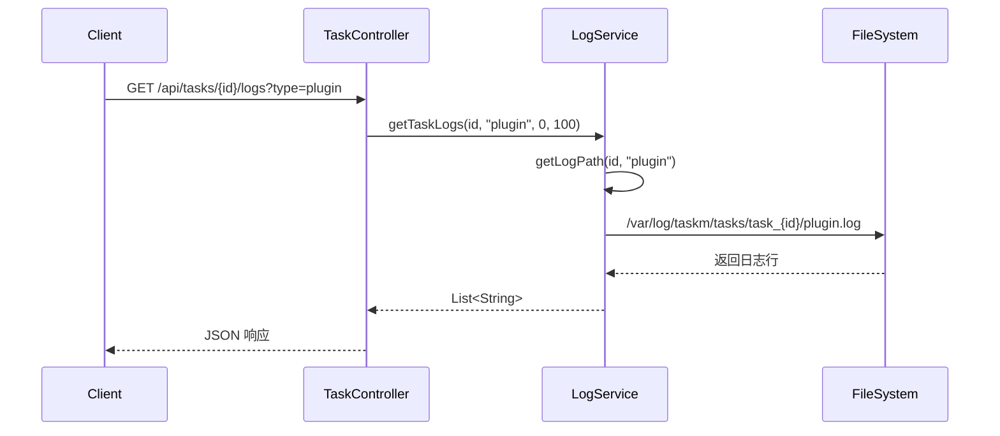

# Issue #28: 日志管理实现

## 概述

Issue #28 实现了基于容器类型的日志分离管理，将策略、插件和监听器的日志分别存储到独立的日志文件中，便于调试和问题排查。

## 日志目录结构

```
/var/log/taskm/
└── tasks/
    └── task_{id}/
        ├── strategy.log    # 策略容器日志
        ├── plugin.log      # 插件容器日志
        └── listener.log    # 监听器容器日志
```

## 主要实现类

### 1. LogService 接口（更新）
**路径**: `hs-taskm-core/src/main/java/com/taskm/service/LogService.java`

**新增方法**:
```java
// 获取所有类型的日志
Map<String, List<String>> getAllTaskLogs(Long taskId);

// 获取所有类型的元数据
Map<String, LogMetadata> getAllLogMetadata(Long taskId);

// 确保日志目录存在
void ensureLogDirectory(Long taskId);
```

**更新的方法**（添加 type 参数）:
```java
List<String> getTaskLogs(Long taskId, String type, int offset, int limit);
List<String> getLogTail(Long taskId, String type, int lines);
List<String> searchLogs(Long taskId, String type, String keyword, int limit);
LogMetadata getLogMetadata(Long taskId, String type);
```

### 2. LogServiceImpl 实现（重构）
**路径**: `hs-taskm-core/src/main/java/com/taskm/service/impl/LogServiceImpl.java`

**核心改动**:
- 移除 `LogRouter` 依赖，直接构造日志路径
- 使用常量定义基础目录和日志类型：
```java
private static final String BASE_LOG_DIR = "/var/log/taskm/tasks";
private static final List<String> LOG_TYPES = List.of("strategy", "plugin", "listener");
```

**日志路径构造**:
```java
private String getLogPath(Long taskId, String type) {
    return String.format("%s/task_%d/%s.log", BASE_LOG_DIR, taskId, type);
}
```

**实现 getAllTaskLogs**:
```java
@Override
public Map<String, List<String>> getAllTaskLogs(Long taskId) {
    Map<String, List<String>> allLogs = new HashMap<>();

    for (String type : LOG_TYPES) {
        String logPath = getLogPath(taskId, type);
        File logFile = new File(logPath);

        if (logFile.exists()) {
            try {
                List<String> lines = Files.readAllLines(Paths.get(logPath));
                allLogs.put(type, lines);
            } catch (IOException e) {
                logger.error("Failed to read log file for task {} type {}", taskId, type, e);
                allLogs.put(type, List.of("Error reading log file: " + e.getMessage()));
            }
        } else {
            allLogs.put(type, List.of());
        }
    }

    return allLogs;
}
```

**实现 ensureLogDirectory**:
```java
@Override
public void ensureLogDirectory(Long taskId) {
    Path taskDir = getTaskDirectory(taskId);

    try {
        if (!Files.exists(taskDir)) {
            Files.createDirectories(taskDir);
            logger.info("Created log directory for task {}: {}", taskId, taskDir);
        }
    } catch (IOException e) {
        logger.error("Failed to create log directory for task {}: {}", taskId, taskDir, e);
        throw new RuntimeException("Failed to create log directory for task " + taskId, e);
    }
}
```

### 3. CodeSnippetInjectorImpl（更新）
**路径**: `hs-taskm-core/src/main/java/com/taskm/service/impl/CodeSnippetInjectorImpl.java`

**添加 LOG_TYPE 环境变量**:
```java
// Log type (for log routing)
env.put("LOG_TYPE", "strategy");
```

**更新卷挂载配置**:
```java
// Volume mounts (log directory)
Map<String, String> volumes = new HashMap<>();
// Mount task-specific log directory for strategy logs
volumes.put(getLogDirectoryPath(taskId), "/app/logs");
// Mount shared log directory for all task logs (needed by plugin/listener SDK)
volumes.put("/var/log/taskm", "/var/log/taskm");
config.setVolumeMounts(volumes);
```

### 4. PluginContainerManagerImpl（更新）
**路径**: `hs-taskm-service/src/main/java/com/taskm/service/impl/PluginContainerManagerImpl.java`

**添加 LOG_TYPE 环境变量**:
```java
CreateContainerResponse response = dockerClient.createContainerCmd(plugin.getImageName())
    .withName(containerName)
    .withEnv("INSTANCES_CONFIG=" + instancesConfigJson)
    .withEnv("LOG_TYPE=plugin")  // 新增
    .withExposedPorts(exposedPort)
    .withHostConfig(HostConfig.newHostConfig()
        .withPortBindings(bindings)
        .withBinds(Bind.parse("/var/log/taskm:/var/log/taskm:rw"))  // 更新
        .withRestartPolicy(RestartPolicy.onFailureRestart(3))
    )
    .exec();
```

### 5. ListenerContainerManagerImpl（更新）
**路径**: `hs-taskm-service/src/main/java/com/taskm/service/impl/ListenerContainerManagerImpl.java`

**添加 LOG_TYPE 环境变量**:
```java
CreateContainerResponse response = dockerClient.createContainerCmd(listener.getImageName())
    .withName(containerName)
    .withEnv("INSTANCES_CONFIG=" + instancesConfigJson)
    .withEnv("LOG_TYPE=listener")  // 新增
    .withExposedPorts(exposedPort)
    .withHostConfig(HostConfig.newHostConfig()
        .withPortBindings(bindings)
        .withBinds(Bind.parse("/var/log/taskm:/var/log/taskm:rw"))  // 更新
        .withRestartPolicy(RestartPolicy.onFailureRestart(3))
    )
    .exec();
```

### 6. TaskOrchestratorImpl（更新）
**路径**: `hs-taskm-core/src/main/java/com/taskm/service/impl/TaskOrchestratorImpl.java`

**启动任务前创建日志目录**:
```java
// Step 3: Ensure log directory exists
logger.info("Ensuring log directory exists for task {}", taskId);
codeSnippetInjector.ensureLogDirectory(taskId);
```

**更新卷挂载配置**:
```java
// Volume binds (log directories)
String taskLogDir = Paths.get("./logs", "task-" + task.getId()).toString();
String taskmLogDir = Paths.get("./logs", "taskm", "tasks", "task-" + task.getId()).toString();

config.setBinds(List.of(
    taskmLogDir + ":/var/log/taskm/tasks/task_" + task.getId() + ":rw",
    taskLogDir + ":/app/logs:rw"
));
```

### 7. TaskController（更新）
**路径**: `hs-taskm-api/src/main/java/com/taskm/controller/TaskController.java`

**所有日志 API 添加 type 参数**:
```java
@GetMapping("/{id}/logs")
public Result<LogResult> getTaskLogs(
    @PathVariable Long id,
    @RequestParam(defaultValue = "strategy") String type,  // 新增
    @RequestParam(defaultValue = "0") int offset,
    @RequestParam(defaultValue = "100") int limit) {

    LogService.LogMetadata metadata = logService.getLogMetadata(id, type);
    List<String> lines = logService.getTaskLogs(id, type, offset, limit);
    // ...
}
```

## 核心流程

### 日志分离流程

```mermaid
flowchart TD
    A[任务启动] --> B[TaskOrchestrator.ensureLogDirectory]
    B --> C[创建 /var/log/taskm/tasks/task_{id}/]
    C --> D[启动 Strategy 容器]
    D --> E[LOG_TYPE=strategy]
    E --> F[日志写入 strategy.log]
    C --> G[启动 Plugin 容器]
    G --> H[LOG_TYPE=plugin]
    H --> I[日志写入 plugin.log]
    C --> J[启动 Listener 容器]
    J --> K[LOG_TYPE=listener]
    K --> L[日志写入 listener.log]
```

### 读取日志流程



## API 变更

### 1. 获取任务日志
**旧接口**:
```
GET /api/tasks/{id}/logs?offset=0&limit=100
```

**新接口**:
```
GET /api/tasks/{id}/logs?type=strategy&offset=0&limit=100
```

**参数**:
- `type`: 日志类型（strategy | plugin | listener），默认为 "strategy"
- `offset`: 起始行号，默认为 0
- `limit`: 最大行数，默认为 100

### 2. 获取日志尾部
**新接口**:
```
GET /api/tasks/{id}/logs/tail?type=strategy&lines=50
```

### 3. 搜索日志
**新接口**:
```
GET /api/tasks/{id}/logs/search?type=strategy&keyword=ERROR&limit=100
```

## 环境变量

每个容器都会设置 `LOG_TYPE` 环境变量：

| 容器类型 | LOG_TYPE 值 | 日志文件路径 |
|---------|------------|-------------|
| Strategy | "strategy" | /var/log/taskm/tasks/task_{id}/strategy.log |
| Plugin | "plugin" | /var/log/taskm/tasks/task_{id}/plugin.log |
| Listener | "listener" | /var/log/taskm/tasks/task_{id}/listener.log |

## 卷挂载

所有容器都挂载以下卷：

```yaml
volumes:
  - /host/path/taskm/tasks/task_{id}:/var/log/taskm/tasks/task_{id}:rw
```

## 向后兼容性

- API 默认 `type` 参数为 "strategy"，保持向后兼容
- 旧的日志查询接口仍然有效（默认查询 strategy 日志）
- 客户端需要更新才能查询 plugin/listener 日志

## 测试

### LogServiceTest 更新

所有测试方法更新为支持 `type` 参数：

```java
@Test
void testGetTaskLogs_shouldReturnLogLinesWithOffsetAndLimit() {
    List<String> logs = logService.getTaskLogs(testTaskId, "strategy", 1, 2);
    assertEquals(2, logs.size());
}

@Test
void testGetAllLogMetadata_shouldReturnAllTypes() throws IOException {
    var metadataMap = logService.getAllLogMetadata(testTaskId);
    assertEquals(3, metadataMap.size());
    assertTrue(metadataMap.containsKey("strategy"));
    assertTrue(metadataMap.containsKey("plugin"));
    assertTrue(metadataMap.containsKey("listener"));
}
```

## 相关文件

| 文件 | 修改类型 | 说明 |
|------|---------|------|
| LogService.java | 更新 | 添加 type 参数和新方法 |
| LogServiceImpl.java | 重构 | 移除 LogRouter，实现类型分离 |
| CodeSnippetInjectorImpl.java | 更新 | 添加 LOG_TYPE 环境变量 |
| PluginContainerManagerImpl.java | 更新 | 添加 LOG_TYPE 和卷挂载 |
| ListenerContainerManagerImpl.java | 更新 | 添加 LOG_TYPE 和卷挂载 |
| TaskOrchestratorImpl.java | 更新 | 调用 ensureLogDirectory |
| TaskController.java | 更新 | API 添加 type 参数 |
| LogServiceTest.java | 更新 | 测试添加 type 参数 |

## 优势

1. **清晰的日志分离**: 不同容器的日志分开存储，便于调试
2. **灵活的查询**: 可以单独查看某个容器的日志
3. **统一的日志管理**: 通过 LogService 统一管理所有类型的日志
4. **易于扩展**: 未来可以添加更多容器类型

## 注意事项

1. **日志目录权限**: 确保 Docker 容器有权限写入日志目录
2. **日志清理**: 需要定期清理旧任务日志，避免磁盘占用过多
3. **性能影响**: 日志写入应使用异步方式，避免影响任务执行性能

---

**实现日期**: 2026-03-23
**Issue 编号**: #28
**文档版本**: 1.0
