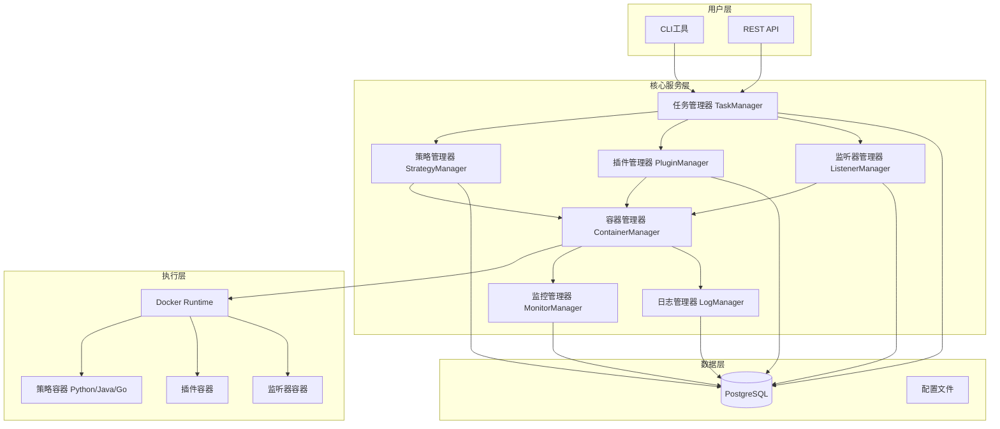
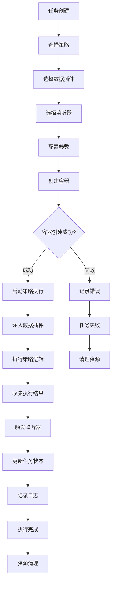
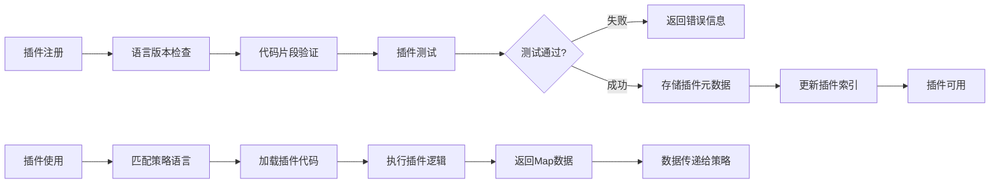
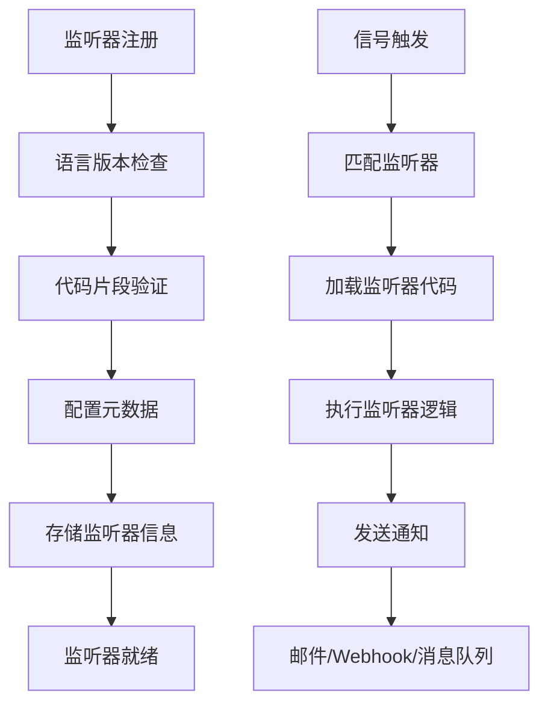
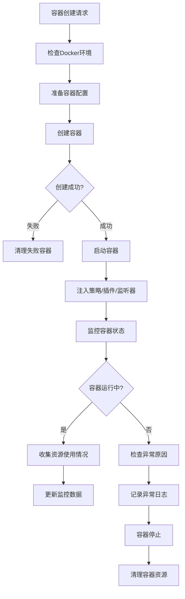
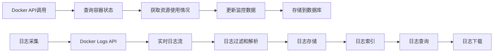
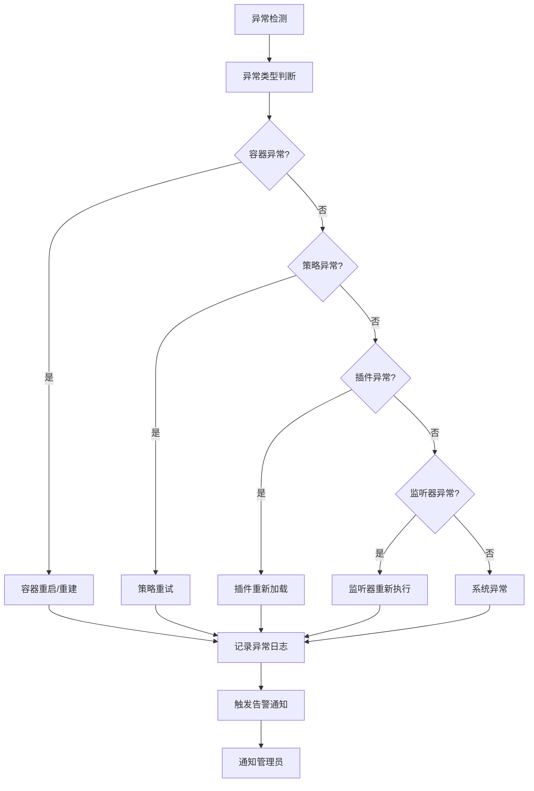
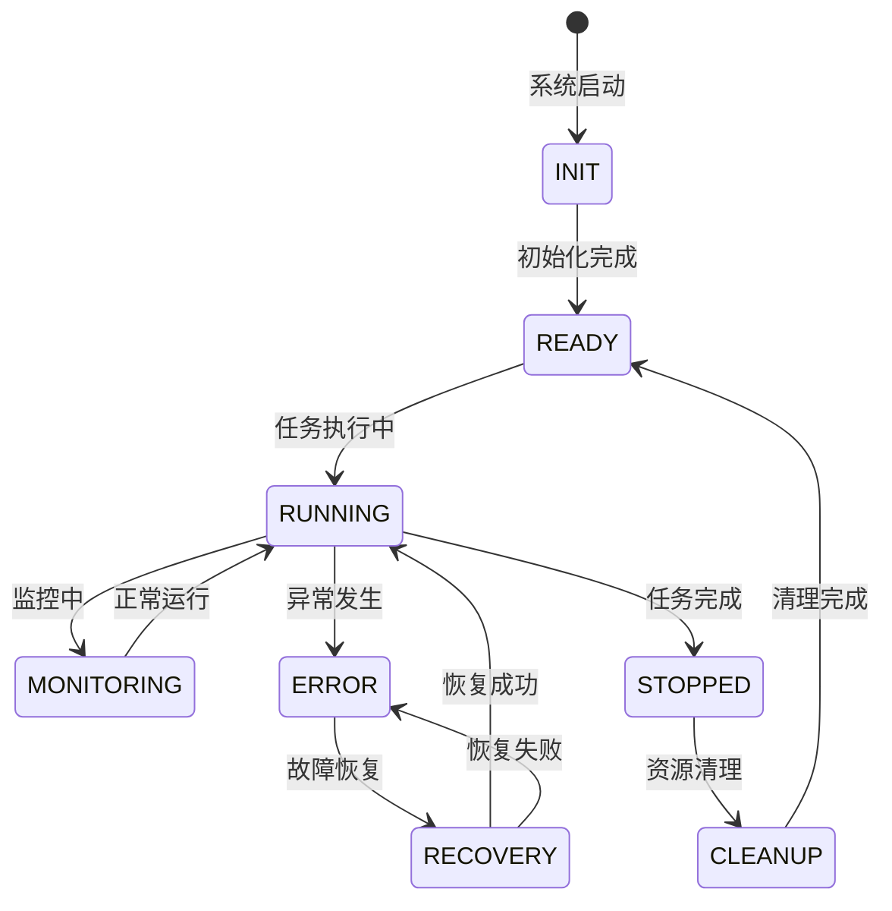

# HS-TASKM 系统逻辑流转图

## 1. 核心系统架构

```mermaid
graph TB
    subgraph "用户层"
        CLI[CLI工具]
        API[REST API]
    end
    
    subgraph "核心服务层"
        TM[任务管理器 TaskManager]
        SM[策略管理器 StrategyManager]
        PM[插件管理器 PluginManager] 
        LM[监听器管理器 ListenerManager]
        CM[容器管理器 ContainerManager]
        MM[监控管理器 MonitorManager]
        LOG[日志管理器 LogManager]
    end
    
    subgraph "执行层"
        DOCKER[Docker Runtime]
        STRATEGY[策略容器 Python/Java/Go]
        PLUGIN[插件容器]
        LISTENER[监听器容器]
    end
    
    subgraph "数据层"
        DB[(PostgreSQL)]
        CONFIG[配置文件]
    end
    
    CLI --> TM
    API --> TM
    TM --> SM
    TM --> PM
    TM --> LM
    SM --> CM
    PM --> CM
    LM --> CM
    CM --> DOCKER
    DOCKER --> STRATEGY
    DOCKER --> PLUGIN
    DOCKER --> LISTENER
    CM --> MM
    CM --> LOG
    TM --> DB
    SM --> DB
    PM --> DB
    LM --> DB
    MM --> DB
    LOG --> DB
```

## 2. 策略执行流程

```mermaid
graph TD
    A[任务创建] --> B[选择策略]
    B --> C[选择数据插件]
    C --> D[选择监听器]
    D --> E[配置参数]
    E --> F[创建容器]
    F --> G{容器创建成功?}
    G -->|失败| H[记录错误]
    G -->|成功| I[启动策略执行]
    I --> J[注入数据插件]
    J --> K[执行策略逻辑]
    K --> L[收集执行结果]
    L --> M[触发监听器]
    M --> N[更新任务状态]
    N --> O[记录日志]
    O --> P[执行完成]
    H --> Q[任务失败]
    Q --> R[清理资源]
    P --> S[资源清理]
```

## 3. 数据插件管理流程

```mermaid
graph LR
    A[插件注册] --> B[语言版本检查]
    B --> C[代码片段验证]
    C --> D[插件测试]
    D --> E{测试通过?}
    E -->|失败| F[返回错误信息]
    E -->|成功| G[存储插件元数据]
    G --> H[更新插件索引]
    H --> I[插件可用]
    
    J[插件使用] --> K[匹配策略语言]
    K --> L[加载插件代码]
    L --> M[执行插件逻辑]
    M --> N[返回Map数据]
    N --> O[数据传递给策略]
```

## 4. 监听器管理流程

```mermaid
graph TD
    A[监听器注册] --> B[语言版本检查]
    B --> C[代码片段验证]
    C --> D[配置元数据]
    D --> E[存储监听器信息]
    E --> F[监听器就绪]
    
    G[信号触发] --> H[匹配监听器]
    H --> I[加载监听器代码]
    I --> J[执行监听器逻辑]
    J --> K[发送通知]
    K --> L[邮件/Webhook/消息队列]
```

## 5. 容器生命周期管理

```mermaid
graph TD
    A[容器创建请求] --> B[检查Docker环境]
    B --> C[准备容器配置]
    C --> D[创建容器]
    D --> E{创建成功?}
    E -->|失败| F[清理失败容器]
    E -->|成功| G[启动容器]
    G --> H[注入策略/插件/监听器]
    H --> I[监控容器状态]
    I --> J{容器运行中?}
    J -->|是| K[收集资源使用情况]
    J -->|否| L[检查异常原因]
    K --> M[更新监控数据]
    L --> N[记录异常日志]
    N --> O[容器停止]
    O --> P[清理容器资源]
```

## 6. 监控与日志流程

```mermaid
graph LR
    A[Docker API调用] --> B[查询容器状态]
    B --> C[获取资源使用情况]
    C --> D[更新监控数据]
    D --> E[存储到数据库]
    
    F[日志采集] --> G[Docker Logs API]
    G --> H[实时日志流]
    H --> I[日志过滤和解析]
    I --> J[日志存储]
    J --> K[日志索引]
    K --> L[日志查询]
    L --> M[日志下载]
```

## 7. 异常处理流程

```mermaid
graph TD
    A[异常检测] --> B[异常类型判断]
    B --> C{容器异常?}
    C -->|是| D[容器重启/重建]
    C -->|否| E{策略异常?}
    E -->|是| F[策略重试]
    E -->|否| G{插件异常?}
    G -->|是| H[插件重新加载]
    G -->|否| I{监听器异常?}
    I -->|是| J[监听器重新执行]
    I -->|否| K[系统异常]
    D --> L[记录异常日志]
    F --> L
    H --> L
    J --> L
    K --> L
    L --> M[触发告警通知]
    M --> N[通知管理员]
```

## 8. 系统状态流转

```mermaid
stateDiagram-v2
    [*] --> INIT: 系统启动
    INIT --> READY: 初始化完成
    READY --> RUNNING: 任务执行中
    RUNNING --> MONITORING: 监控中
    MONITORING --> RUNNING: 正常运行
    RUNNING --> ERROR: 异常发生
    ERROR --> RECOVERY: 故障恢复
    RECOVERY --> RUNNING: 恢复成功
    RECOVERY --> ERROR: 恢复失败
    RUNNING --> STOPPED: 任务完成
    STOPPED --> CLEANUP: 资源清理
    CLEANUP --> READY: 清理完成
```