# HS-TASKM 系统逻辑流转图

## 1. 核心系统架构

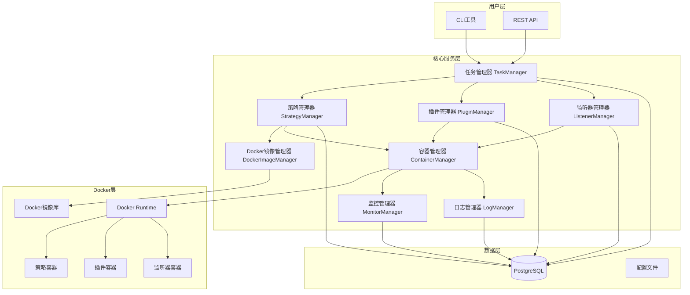

## 2. 策略管理流程

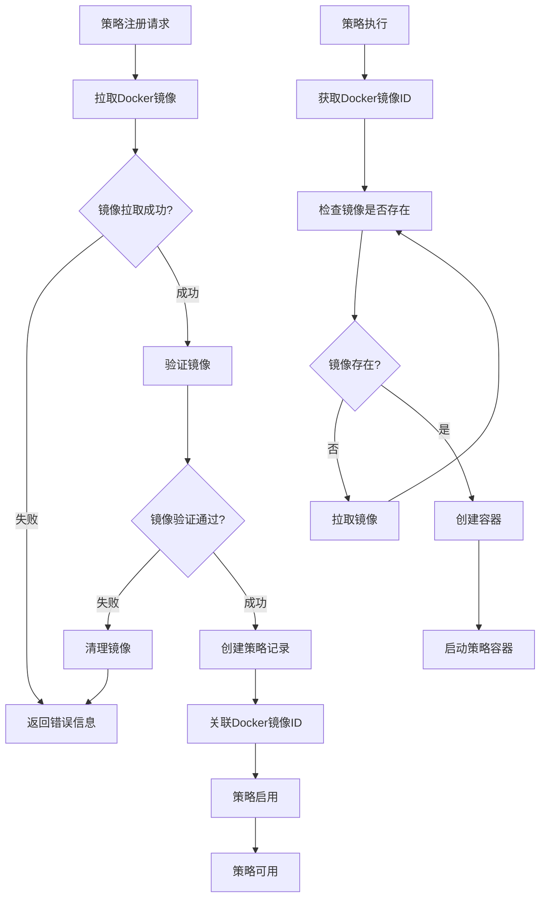

## 3. Docker镜像管理流程

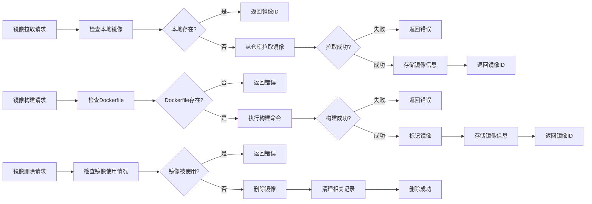

## 4. 数据插件管理流程

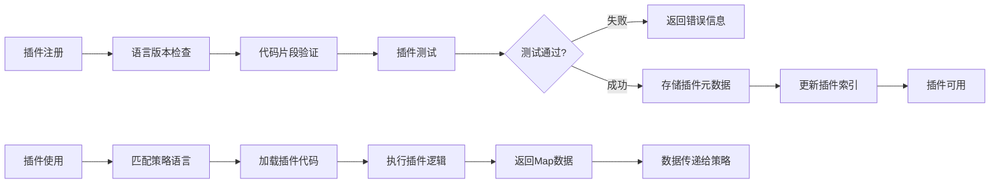

## 5. 监听器管理流程

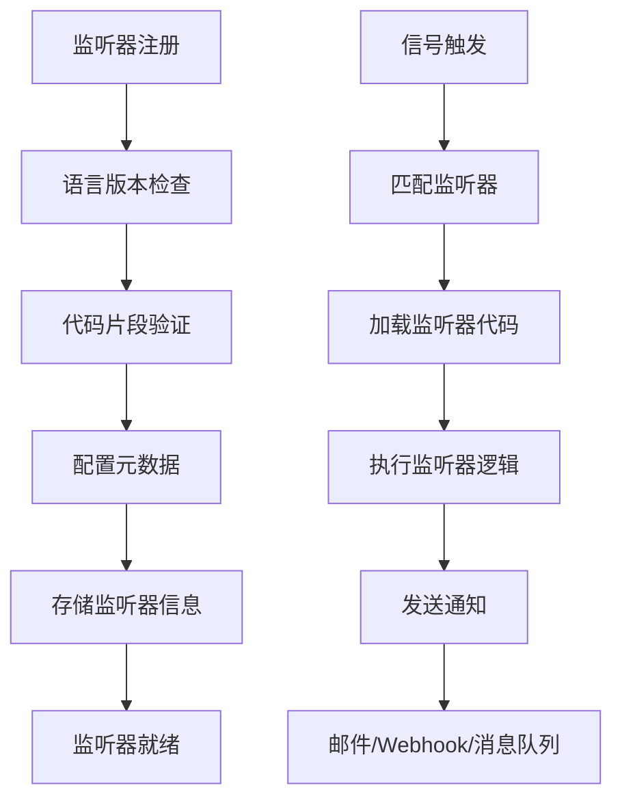

## 6. 任务执行流程

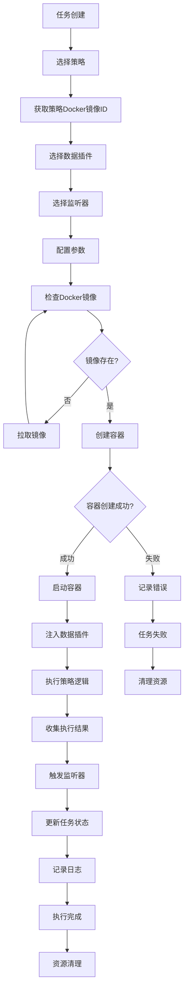

## 7. 容器生命周期管理

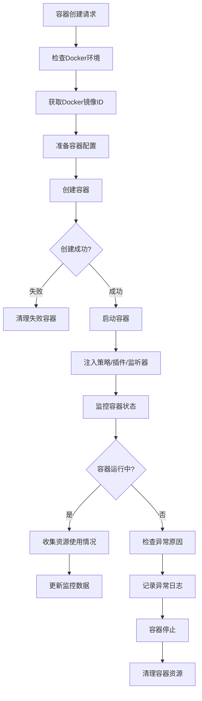

## 8. 监控与日志流程

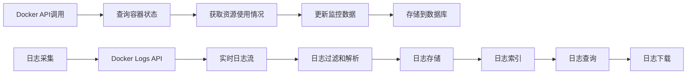

## 9. 异常处理流程

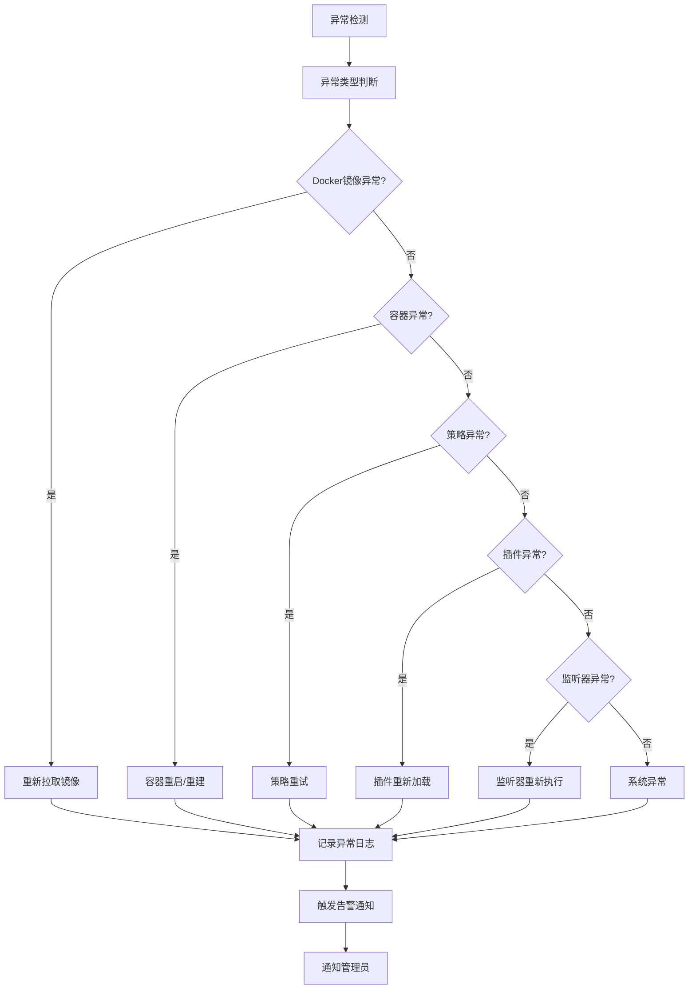

## 10. 系统状态流转

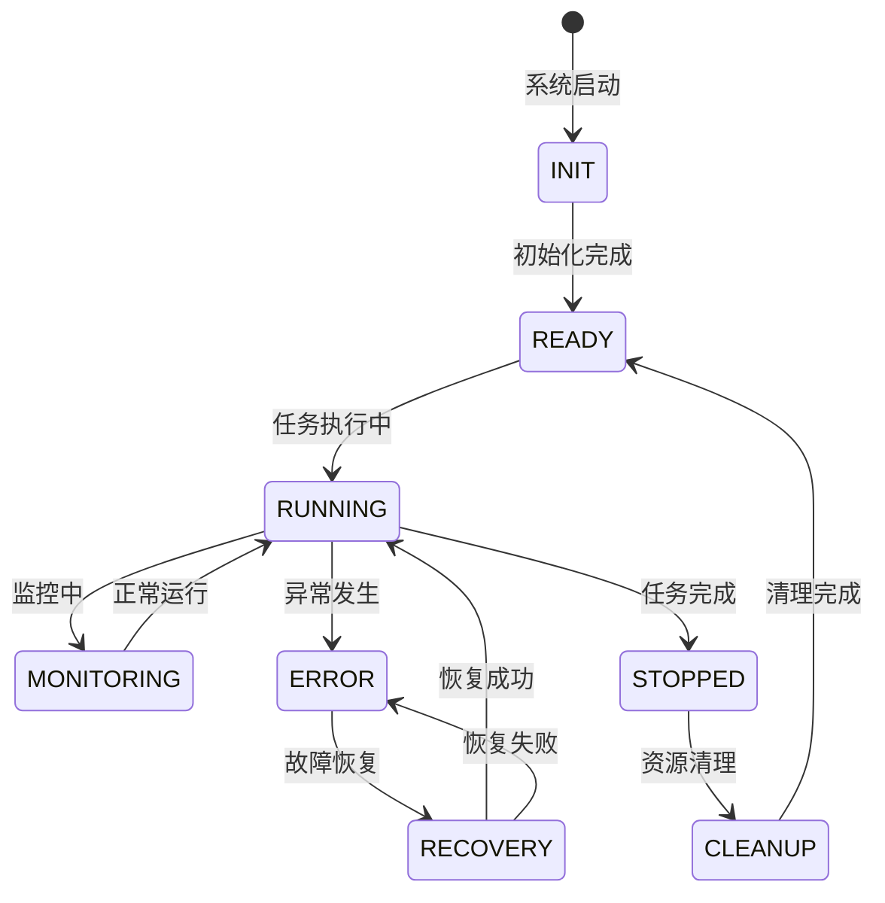

## 11. 策略与Docker镜像关联流程

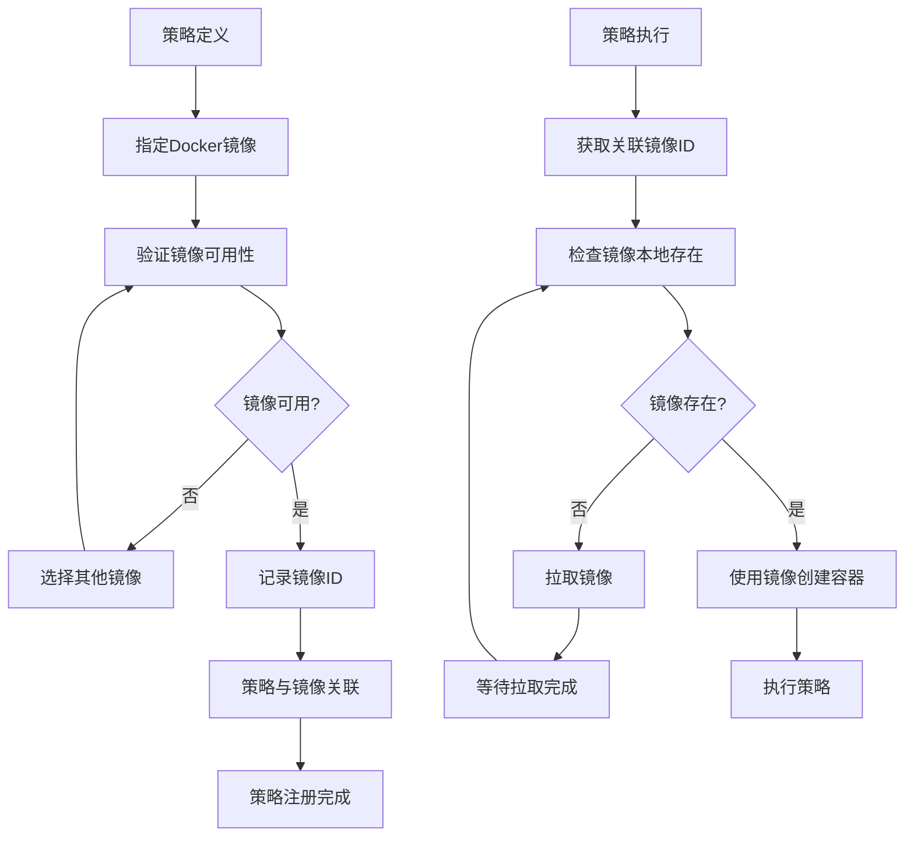