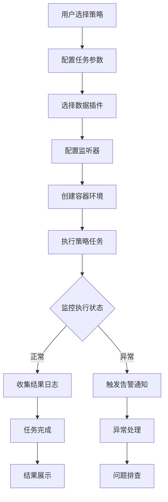

# 产品需求文档 (PRD) - HS-TASKM

## 1. 项目分类 (Project Classification)

- **Type**: \[NON-WEB]

## 2. 业务背景

HS-TASKM 是一个多语言策略容器化执行平台，支持策略选择、参数配置、自动部署、实时监控的一站式任务管理系统。该系统旨在解决多语言策略执行环境隔离、动态扩展、统一管理的问题，为用户提供完整的策略生命周期管理解决方案。

## 3. 核心功能点 (Functional Requirements)

### **\[F01]**: 策略管理

- **描述**: 管理内置策略的元数据，支持多语言策略的注册、版本控制、启用/禁用
- **验收标准**:
  - 能够注册Python、Java、Go等多语言策略
  - 支持策略版本管理和回滚
  - 提供策略元数据查询接口

### **\[F02]**: 数据插件管理

- **描述**: 管理策略可用的数据插件，本质是一个代码片段（Python、Java、Go），支持插件测试
- **验收标准**:
  - 插件语言版本和策略要对应
  - 插件应该返回的是一个map
  - 提供插件元数据查询接口

### **\[F03]**: 监听器管理

- **描述**: 管理策略产生的信号通知监听器，本质是一个代码片段（Python、Java、Go），支持多种通知方式
- **验收标准**:
  - 监听器语言版本和策略要对应
  - 监听器可配置监听器的自己的元数据
  - 提供监听器元数据查询接口

### **\[F04]**: 任务管理

- **描述**: 用户基于策略创建任务，配置参数后执行，支持任务生命周期管理
- **验收标准**:
  - 支持任务创建、启动、停止、删除
  - 支持任务参数配置和模板管理
  - 提供任务执行状态实时查询

### **\[F05]**: 容器管理

- **描述**: 管理 Docker 容器的创建、运行、监控、销毁，确保策略隔离执行
- **验收标准**:
  - 支持Docker容器生命周期管理
  - 提供容器资源使用监控
  - 支持容器网络和存储配置

### **\[F06]**: 监控

- **描述**: 实时监控任务执行状态、容器资源、
- **验收标准**:
  - 使用原生docker api 查询docker状态，容器资源情况

### **\[F07]**: 日志管理

- **描述**: 容器日志采集、存储、查询、下载，支持日志分析和导出 ，本质调用docker logs
- **验收标准**:
  - 支持容器日志实时采集
  - 提供日志搜索和过滤功能
  - 支持日志批量下载和导出

## 4. 业务流转 (Business Flow)



## 5. 技术架构

### 后端技术栈

- **框架**: Java (Spring Boot 3.x)
- **容器运行时**: Docker&#x20;
- **任务调度**: XXL-JOB / PowerJob
- **数据库**: postgres
- **监控**:Docker自带监控
- **CLI工具**: Spring Boot + Picocli

### 项目结构

```
hs-taskm/
├── hs-taskm-core      # 核心模块
├── hs-taskm-api       # API 模块
├── hs-taskm-service   # 业务逻辑模块
├── hs-taskm-dao       # 数据访问层模块
├── hs-taskm-cli       # CLI 工具模块
├── hs-taskm-common    # 公共模块
└── hs-taskm-docker    # Docker 集成模块
```

## 6. 非功能性需求

### 性能需求

- **并发处理**: 支持100+容器同时运行
- **响应时间**: API响应时间 < 500ms
- **任务调度**: 支持秒级任务调度精度

### 可靠性需求

- **容器隔离**: 策略执行环境完全隔离
- **数据一致性**: 任务执行结果数据一致性保证
- **故障恢复**: 支持任务失败后自动重试

### 安全性需求

- **权限控制**: 基于角色的访问控制(RBAC)
- **容器安全**: 容器资源限制和安全扫描
- **数据加密**: 敏感配置数据加密存储

### 可扩展性需求

- **水平扩展**: 支持多节点部署
- **插件扩展**: 支持第三方插件开发
- **API扩展**: RESTful API设计，支持第三方集成

## 7. 关键设计特点

1. **策略隔离**: 不同语言策略通过 Docker 容器隔离执行
2. **插件化架构**: 支持数据插件和监听器的动态扩展
3. **事件驱动**: 通过监听器实现事件驱动的通知机制
4. **CLI优先**: 提供完整的命令行工具，便于自动化集成
5. **简化监控**: 直接使用 Docker 命令进行监控，降低复杂性

